# ExGPU — GPU Compute Exchange

ExGPU is a two-part system: a **Spring Boot 3.5 / Java 21 exchange service** that runs an in-memory, three-dimensional limit order book (price × quantity × **time window**) over PostgreSQL, and a **Next.js 16 / React 19 marketplace frontend** that browses and trades against it. Providers list GPU capacity as `SELL` orders and buyers request it as `BUY` orders; the matching engine pairs them only when price, remaining quantity **and** time window are all compatible, producing an `Allocation` — a booked rental, charged up front against a prepaid token balance, that yields a time-bounded `AccessLease` and a short-lived HMAC-signed access credential. Usage telemetry arrives over REST or a Kafka consumer with a dead-letter queue; identity is delegated entirely to Supabase Auth, whose ES256 JWTs the API validates as an OAuth2 resource server; live activity is pushed back to browsers over STOMP-over-WebSocket on per-user queues; and Micrometer/Prometheus/Grafana provide the operational view.

Architecturally this is a **modular monolith with external event infrastructure**, not a microservice fleet: one JVM owns matching, billing, leasing and telemetry ingestion as separate packages behind Spring transactions, with Kafka, PostgreSQL, Prometheus and Grafana as out-of-process dependencies and Supabase as the only third-party API. Communication is REST/JSON between browser and API, STOMP-over-WebSocket for server push, Kafka JSON for asynchronous telemetry, and JDBC for persistence. There is no gRPC, no protobuf, no object storage, no AI/LLM component, and no cloud infrastructure code in this repository.

> **Documentation status.** Everything below was verified against the source on **2026-09-02** by reading the code, configuration and migrations, and by running the Java test suite (`./mvnw test` → **158 tests, 0 failures, exit code 0**, Temurin 21.0.9). Where a capability is designed but not built, or exists only for local development, it is labelled explicitly. Two older in-repo documents — [`exgpu/EXGPU_APP_EXPLANATION.txt`](exgpu/EXGPU_APP_EXPLANATION.txt) (self-dated 2026-06-13) and [`exgpu/PROJECT_WALKTHROUGH.md`](exgpu/PROJECT_WALKTHROUGH.md) — predate the concurrency, lifecycle, auth and frontend work and are **partly superseded by this file**. Where they disagree with this README, this README reflects the current code.

---

## Table of contents

- [1. System overview](#1-system-overview)
- [2. Technology stack](#2-technology-stack)
- [3. Repository structure](#3-repository-structure)
- [4. Architecture](#4-architecture)
- [5. Networking and communication protocols](#5-networking-and-communication-protocols)
- [6. Request lifecycles](#6-request-lifecycles)
- [7. HTTP API reference](#7-http-api-reference)
- [8. gRPC / Protobuf contracts](#8-grpc--protobuf-contracts)
- [9. Realtime architecture](#9-realtime-architecture)
- [10. Data architecture](#10-data-architecture)
- [11. Database schema](#11-database-schema)
- [12. Caching architecture](#12-caching-architecture)
- [13. Authentication and authorization](#13-authentication-and-authorization)
- [14. Security model](#14-security-model)
- [15. AI / agent architecture](#15-ai--agent-architecture)
- [16. Algorithms](#16-algorithms)
- [17. Concurrency and consistency](#17-concurrency-and-consistency)
- [18. Asynchronous processing](#18-asynchronous-processing)
- [19. Infrastructure](#19-infrastructure)
- [20. Containerization](#20-containerization)
- [21. Deployment architecture](#21-deployment-architecture)
- [22. CI/CD](#22-cicd)
- [23. Configuration and environment variables](#23-configuration-and-environment-variables)
- [24. Observability](#24-observability)
- [25. Metrics and performance](#25-metrics-and-performance)
- [26. Scalability](#26-scalability)
- [27. Reliability and failure modes](#27-reliability-and-failure-modes)
- [28. Error handling](#28-error-handling)
- [29. External integrations](#29-external-integrations)
- [30. Testing strategy](#30-testing-strategy)
- [31. Local development](#31-local-development)
- [32. Complete local startup order](#32-complete-local-startup-order)
- [33. Development workflows](#33-development-workflows)
- [34. Design decisions](#34-design-decisions)
- [35. Technical tradeoffs](#35-technical-tradeoffs)
- [36. Known limitations](#36-known-limitations)
- [37. System design summary](#37-system-design-summary)
- [38. Engineering numbers](#38-engineering-numbers)
- [39. Glossary](#39-glossary)
- [40. Complete architecture diagram](#40-complete-architecture-diagram)
- [41. Code map](#41-code-map)

---

## 1. System overview

### What the system does

ExGPU brokers **time-windowed GPU capacity**. The unit of trade is not "a GPU" but "N GPUs, between T₁ and T₂, at a price per GPU-hour". That third dimension is what makes the order book non-standard: two orders that agree on price and quantity still do not match unless their windows overlap, and when they do, the trade clears over the **intersection** of the two windows rather than either one's full span (`MatchingEngine.runMatch`).

### Primary user flows

| Flow | Actor | Entry point | Outcome |
| --- | --- | --- | --- |
| Browse capacity anonymously | Visitor | `GET /market/supply` | Anonymised listings — no seller identity |
| Sign up / sign in | Buyer or provider | Supabase Auth via the browser SDK | ES256 JWT in a cookie-backed session |
| Fund an account | Buyer | `POST /balances` | `token_balances` row created or credited |
| Rent capacity | Buyer | `POST /orders` with `side=BUY` | Match → `Allocation` → up-front charge → `AccessLease` |
| List capacity | Provider | `POST /orders` with `side=SELL` | Resting order, optionally a recurring series |
| Fill an open request | Provider | `POST /orders/demand/{buyOrderId}/fill` | Mirrored SELL that matches on submission |
| Get into a rental | Buyer | `GET /me/rentals/{allocationId}/access` | HMAC-signed 15-minute credential while in-window |
| Cancel a rental | Buyer | `POST /me/rentals/{allocationId}/cancel` | Tiered refund, lease revocation, capacity returned to the seller |
| Report usage | Provider agent or Kafka producer | `POST /usage-events`, topic `exgpu.usage-events` | Idempotent `usage_ledger` metering row |

### Synchronous vs asynchronous work

| Operation | Mode | Notes |
| --- | --- | --- |
| Order placement, matching, charging, lease creation | **Synchronous**, one transaction | `OrderService.placeOrder` is `@Transactional`; matching is pure in-memory work with no I/O under the book locks |
| Market and listing reads | Synchronous | JPQL against `orders` |
| Realtime notification | **Asynchronous**, post-commit | `AfterCommit.run(...)` defers publication until the transaction actually commits |
| Kafka telemetry ingestion | **Asynchronous** | `@KafkaListener` on `exgpu.usage-events`, DLQ on failure |
| Lease lifecycle transitions | **Asynchronous**, scheduled | `AccessLeaseScheduler`, 15 s fixed delay |
| Order expiry sweep | **Asynchronous**, scheduled | `OrderExpiryScheduler`, 60 s fixed delay |
| Order-book rehydration | **Asynchronous**, once at startup | `OrderBookRehydrator` on `ApplicationReadyEvent` |

### Stateful vs stateless components

| Component | State | Consequence |
| --- | --- | --- |
| `MatchingEngine` | **Stateful, JVM heap** — the entire live order book plus a 15-minute bucket index | Single-instance assumption, documented in the class Javadoc. Two instances against one database would each match independently and could double-sell the same capacity |
| PostgreSQL | Stateful, durable | The authoritative record; the book is rebuilt from it at startup |
| REST layer | Stateless | `SessionCreationPolicy.STATELESS`, JWT bearer auth, no server-side session |
| STOMP broker | Stateful per connection | In-memory `SimpleBroker`; sessions and subscriptions live in the JVM |
| Next.js frontend | Stateless server, stateful client | Supabase session in cookies; theme in `localStorage` |
| Kafka | Stateful, external | Single broker in Compose; offsets in `__consumer_offsets` |

### High-level architecture

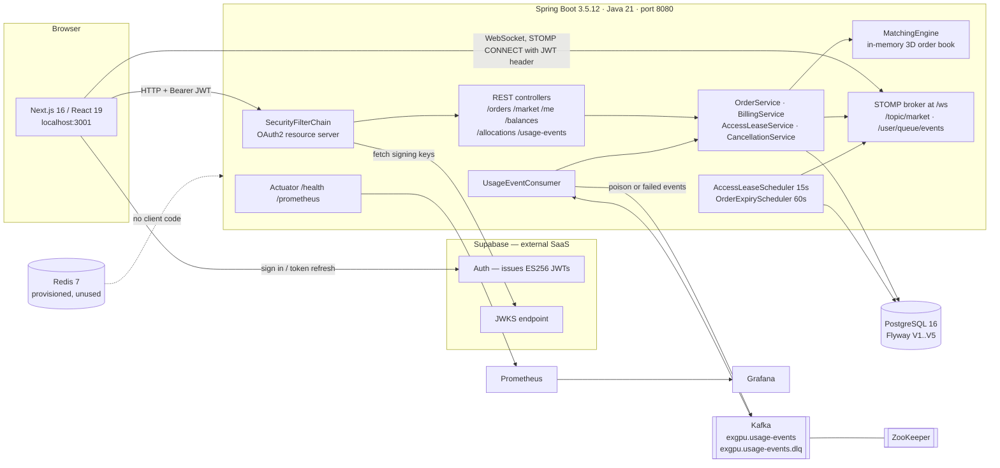

---

## 2. Technology stack

### Languages

| Language | Where used | Why |
| --- | --- | --- |
| **Java 21** | `exgpu/` — the entire backend, 72 main source files, 5,980 LOC | Virtual threads (`spring.threads.virtual.enabled=true`), records for DTOs, text blocks for JPQL, switch expressions |
| **TypeScript 5.9** | `frontend/src` — 46 files, ~7,000 LOC, `strict: true` | Type-mirrors the backend DTO contract in `frontend/src/lib/types.ts` |
| **SQL (PostgreSQL)** | 5 Flyway migrations plus a development seed script | The schema is owned by SQL, never by Hibernate (`ddl-auto=none`) |
| **JPQL** | `repository/*.java` text blocks | Conditional bulk `UPDATE`s that are the system's idempotency primitive |
| **PromQL** | `exgpu/grafana/dashboards/exgpu.json` | 16 dashboard panels |
| **Bash / PowerShell** | `mvnw`, `mvnw.cmd`, `.github/*/hooks/scripts/*` | Maven wrapper and IDE tooling hooks |

### Backend

| Layer | Technology | Version | Responsibility | Where |
| --- | --- | --- | --- | --- |
| Application framework | Spring Boot | 3.5.12 | DI, transactions, MVC, scheduling | `exgpu/pom.xml` |
| HTTP API | `spring-boot-starter-web` (Tomcat) | — | 21 REST endpoints across 6 controllers | `controller/` |
| Security | `spring-boot-starter-security` + `spring-boot-starter-oauth2-resource-server` | — | Deny-by-default chain, ES256/RS256 JWT validation | `config/SecurityConfig.java` |
| Persistence | Spring Data JPA / Hibernate | — | 5 repositories, 6 entities | `repository/`, `domain/` |
| Migrations | Flyway + `flyway-database-postgresql` | — | `V1`→`V5` under `classpath:db/migrations` | `resources/db/migrations/` |
| Validation | Jakarta Bean Validation | — | Bounds on price, quantity, amount, usage seconds, event id | `dto/` |
| Messaging | `spring-kafka` | — | One consumer, one DLQ producer | `kafka/` |
| Realtime | `spring-boot-starter-websocket` (STOMP, in-memory broker) | — | `/ws` endpoint, user queues plus a market topic | `config/WebSocketConfig.java` |
| Metrics | Micrometer + `micrometer-registry-prometheus` | — | 20 meter names on `/actuator/prometheus` | `metrics/` |
| API docs | `springdoc-openapi-starter-webmvc-ui` | 2.8.17 | Swagger UI and the OpenAPI 3 document | dependency only, no custom config class |
| Boilerplate | Lombok | — | `@Builder`, `@Getter`, `@Setter` on entities | `domain/` |
| Build | Maven wrapper 3.3.4 → Maven 3.9.14 | — | `./mvnw` | `mvnw`, `mvnw.cmd` |

### Frontend

| Concern | Technology | Where |
| --- | --- | --- |
| Framework | Next.js 16.3.3 (App Router), React 19.2.8 | `frontend/src/app` |
| Routes | `/`, `/login`, `/signup`, `/diagnostics`, `/app`, `/app/rent`, `/app/rentals`, `/app/provide`, `/app/billing` | `src/app/**/page.tsx` |
| Route protection | Next.js proxy/middleware — redirects unauthenticated `/app/*` to `/login` and refreshes the Supabase cookie | `src/proxy.ts` |
| State management | React Context only — `AuthProvider` (session), `EventsProvider` (WebSocket feed), `ThemeProvider`. **No Redux, Zustand or React Query** | `src/lib/*-context.tsx` |
| Data fetching | Hand-rolled `fetch` wrapper with a lazily-read token getter and an `ApiError` carrying the HTTP status | `src/lib/api.ts` |
| WebSocket client | `@stomp/stompjs` 7 — `reconnectDelay: 5000`, 10 s heartbeats in both directions | `src/lib/events-context.tsx` |
| Auth client | `@supabase/supabase-js` + `@supabase/ssr` (`createBrowserClient` / `createServerClient`) | `src/lib/supabase.ts`, `src/proxy.ts` |
| Styling | Tailwind CSS 3.4 over CSS-variable design tokens; `darkMode: ["class", '[data-theme="dark"]']` | `tailwind.config.ts`, `src/app/globals.css` |
| Typography | `next/font` self-hosted Inter — required, because the CSP forbids third-party origins | `src/app/layout.tsx` |
| Local persistence | `localStorage` for the theme only, applied by a pre-paint inline script; the Supabase session lives in cookies | `src/lib/theme.tsx` |
| Tooling | ESLint 9 (`eslint-config-next`), `tsc --noEmit`, PostCSS, Autoprefixer | `eslint.config.mjs` |

### Data and infrastructure

| Technology | Version | Role | Status |
| --- | --- | --- | --- |
| PostgreSQL | 16 | Sole system of record — orders, allocations, balances, ledger, leases | **Implemented** |
| Redis | 7 | The container is provisioned and the Spring Data Redis starter is on the classpath, but `RedisAutoConfiguration` and `RedisRepositoriesAutoConfiguration` are **excluded** in `application.properties` and no code references any Redis API | **Provisioned, unused** |
| Apache Kafka | Confluent 7.6.0 | Asynchronous telemetry ingestion plus DLQ | **Implemented (consumer side only)** |
| ZooKeeper | Confluent 7.6.0 | Kafka coordination; its ports are not published to the host | **Implemented** |
| Prometheus | v2.51.0 | Scrapes `host.docker.internal:8080/actuator/prometheus` every 15 s | **Implemented** |
| Grafana | 10.4.2 | Provisioned datasource plus a 16-panel ExGPU dashboard | **Implemented** |
| Docker Compose | — | The complete local topology; every host port bound to `127.0.0.1` | **Implemented, local only** |
| Supabase | hosted | Identity provider (email/password) and JWKS source | **Implemented, external** |
| Avro + Schema Registry | — | Named in `CLAUDE.md`'s target architecture, but the Kafka payload is **JSON** via `JsonDeserializer` and there is no Schema Registry container or dependency | **Not implemented** |

### Communication mechanisms actually present

| Mechanism | Present | Notes |
| --- | --- | --- |
| HTTP/1.1 REST with JSON | Yes | Browser → API; errors as RFC 7807 `ProblemDetail` |
| WebSocket + STOMP | Yes | Raw WebSocket, **no SockJS fallback** |
| Kafka (String keys, JSON values) | Yes | `exgpu.usage-events`, `exgpu.usage-events.dlq` |
| JDBC | Yes | HikariCP → PostgreSQL |
| Outbound HTTPS to a third party | Yes | Supabase Auth and the JWKS fetch |
| gRPC / Protocol Buffers | No | No `.proto` files and no gRPC dependency |
| GraphQL | No | None |
| Server-Sent Events | No | None |
| Inbound webhooks | No | No webhook receiver and no signature verification anywhere |
| Redis pub/sub, streams, locks | No | See the Redis row above |

---

## 3. Repository structure

```text
.
├── exgpu/                                  # Spring Boot backend (the runnable service)
│   ├── src/main/java/com/exgpu/exgpu/
│   │   ├── ExgpuApplication.java           # @SpringBootApplication @EnableScheduling
│   │   ├── config/                         # Security, WebSocket, CORS, transaction + lock wiring
│   │   ├── controller/                     # 7 REST controllers + @RestControllerAdvice
│   │   ├── domain/                         # JPA entities, embeddables, engine value objects
│   │   │   └── enums/                      # OrderStatus, LeaseStatus, ChargeType, RefundTier, ...
│   │   ├── dto/                            # Request/response records (the wire contract)
│   │   ├── engine/                         # MatchingEngine, TimeSliceLockManager,
│   │   │                                   #   RecurrenceExpander, OrderBookRehydrator
│   │   ├── kafka/                          # UsageEventConsumer, UsageEventMessage, DlqMessage
│   │   ├── metrics/                        # ExgpuMetrics (counters/timers), OrderBookMetrics (gauges)
│   │   ├── realtime/                       # RealtimeEventPublisher, event record + enum
│   │   ├── repository/                     # 5 Spring Data JPA repositories
│   │   ├── scheduler/                      # AccessLeaseScheduler, OrderExpiryScheduler
│   │   └── service/                        # Order, Billing, Allocation, AccessLease,
│   │                                       #   Cancellation, AccessCredentialMinter
│   ├── src/main/resources/
│   │   ├── application.properties          # The single source of runtime configuration
│   │   └── db/migrations/V1..V5*.sql       # Flyway-owned schema
│   ├── src/test/                           # 18 test classes, 158 tests, mocks only
│   ├── docker-compose.yml                  # postgres, redis, zookeeper, kafka, prometheus, grafana
│   ├── prometheus/prometheus.yml           # Scrape config
│   ├── grafana/                            # Provisioned datasource + dashboards/exgpu.json
│   ├── seed/seed-marketplace.sql           # Idempotent local marketplace seed (dev only)
│   ├── .env.example                        # Backend + Compose environment template
│   └── pom.xml
│
├── frontend/                               # Next.js marketplace client
│   ├── src/app/                            # App Router: public site + /app dashboard
│   ├── src/components/                     # 18 presentational/interactive components
│   ├── src/lib/                            # api client, auth/events/theme contexts, types, filters
│   ├── src/proxy.ts                        # Route protection + Supabase cookie refresh
│   ├── next.config.mjs                     # CSP + security headers, prod env-var assertions
│   ├── tailwind.config.ts                  # Design tokens
│   └── .env.example
│
├── .github/                                # IDE "java-upgrade" tooling hooks only — NOT CI
├── CLAUDE.md                               # Project brief and target architecture (local-only)
├── SECURITY.md                             # Security posture notes (local-only, partly stale)
├── docs/plans/                             # Design plan for the concurrency/lifecycle work (local-only)
└── README.md
```

**Directory responsibilities**

| Path | Responsibility |
| --- | --- |
| `exgpu/src/main/java/.../engine` | The exchange core. Pure in-memory, no Spring dependencies in `TimeSliceLockManager` or `RecurrenceExpander`, no I/O inside the matching path. |
| `exgpu/src/main/java/.../service` | Transaction boundaries and business rules: order settlement, billing arithmetic, refunds, lease lifecycle, credential minting. |
| `exgpu/src/main/java/.../controller` | HTTP edge. Resolves the caller from the JWT (`CurrentUser`), never from the body, and performs the REST-only authorization checks. |
| `exgpu/src/main/java/.../repository` | Data access, including the conditional bulk `UPDATE`s (`applyFill`, `expirePastWindows`, `activateDueLeases`, `revokeAllForBuyer`) that carry the system's idempotency guarantees. |
| `exgpu/src/main/java/.../kafka` | The asynchronous telemetry doorway and DLQ routing. Deliberately thin: it maps a Kafka record to the same `BillingService` call the REST controller makes. |
| `exgpu/src/main/java/.../realtime` | Server-push fan-out with a privacy split between per-user queues and the anonymous market topic. |
| `exgpu/src/main/resources/db/migrations` | The authoritative schema, including CHECK constraints that back application-level invariants. |
| `frontend/src/lib` | The client-side contract: typed API client, session/token plumbing, WebSocket subscription, and the browse filter/sort logic shared by both sides of the market. |
| `frontend/src/app/app` | The authenticated product surface; `EventsProvider` is mounted here so the WebSocket only opens for signed-in pages. |

**Note on the four `.docx`/local-only files.** `CLAUDE.md`, `SECURITY.md` and `docs/` are listed in `.gitignore` and are not part of the published repository; `GCX_Implementation_Guide.docx` and `GPU_Compute_Exchange_Scope.docx` are ignored planning documents. They describe target architecture, some of which is implemented and some of which is not — this README documents only what the code does.

---

## 4. Architecture

### Architectural style: modular monolith with external event infrastructure

The evidence for that classification, from the repository rather than from intent:

- **One deployable unit.** A single Maven module (`exgpu/pom.xml`, artifact `exgpu`) with one `@SpringBootApplication`. There is no service registry, no inter-service HTTP client, no `.proto`, and no second backend process.
- **Internal modularity is by package and by dependency direction, not by network boundary.** `MatchingEngine` has no `BillingService` dependency (a constraint stated in `CLAUDE.md` and observably honoured); `BillingService` has no `MatchingEngine` dependency. `OrderService` is the composition point that owns the transaction and calls both.
- **Event-driven at the edges only.** Kafka carries telemetry into the system; the WebSocket carries notifications out. Neither is used for internal service-to-service communication — the internal path is direct method calls inside one transaction.
- **Stateful core.** The order book lives in the JVM heap, which is what forces the single-instance assumption and shapes most of the scalability discussion in §26.

### Component: Matching Engine

- **Language / framework:** Java 21, a plain `@Service` with no I/O dependencies.
- **File:** `engine/MatchingEngine.java` (484 lines) with `engine/TimeSliceLockManager.java` (224 lines).
- **Responsibilities:** maintain the live order book; match an incoming order against the opposite side; produce `Allocation`s, `Fill`s and an updated-order list; support restore, remove, expire and compensating rollback.
- **Inputs:** a persisted `Order` (from `OrderService`), a clock instant (only for `expireBefore`), a `MatchResult` (for `rollback`).
- **Outputs:** a `MatchResult` — allocations, per-counterparty fills, updated orders, and a `MatchStatus` of `FULL_FILL` / `PARTIAL_FILL` / `NO_MATCH`.
- **Persistence:** none. It never touches the database; `OrderService` persists what it returns.
- **Data structures:**
  - `buyBook` / `sellBook`: `ConcurrentHashMap<UUID, Order>` — O(1) lookup and exact depth gauges.
  - `buyBuckets` / `sellBuckets`: `ConcurrentHashMap<Long, ConcurrentHashMap<UUID, Order>>` — an order is registered under **every** 15-minute bucket its window spans, so candidate gathering touches only the buckets the incoming window overlaps. Inner maps are deleted when they empty, so the index cannot grow unboundedly.
- **Concurrency:** two modes selected by `exgpu.matching.striped` (production default `true`; the 2-arg constructor used by unit tests defaults to `false`).
- **Failure considerations:** if the surrounding transaction rolls back, `rollback(MatchResult)` decrements each counterparty's `filledQuantity` by the recorded amount (never restoring a snapshot, so it composes with a concurrent unrelated increment) and removes the incoming order. This is **not crash-safe**: a JVM death between the DB rollback and the in-memory unwind leaves a phantom fill until the next restart rehydrates from PostgreSQL.

### Component: Order Service (settlement)

- **File:** `service/OrderService.java` (595 lines) — the largest and most decision-dense class in the system.
- **Responsibilities:** window validation, recurring-series expansion, match orchestration, per-allocation affordability filtering, conditional counterparty writes, charge + lease creation, post-commit metrics and realtime publication, cancellation (single order and whole series), and the market/demand read paths.
- **Transaction boundary:** `@Transactional` around the whole of `placeOrder`, `fillDemand` and `cancelOrder`.
- **Settlement is deliberately not all-or-nothing.** Per allocation:
  - if the payer is the **incoming order's owner** and cannot afford it → `402 PAYMENT_REQUIRED`, the whole placement is rejected, and the registered compensating rollback unwinds every engine mutation;
  - if the payer is a **resting counterparty** who cannot afford it → only that one allocation is dropped, that counterparty's fill is compensated, their order stays in the book, `exgpu_booking_charge_failures_total` is incremented, and the placement otherwise succeeds. A seller is not punished for a stranger's empty wallet.
- **Failure considerations:** counterparty rows are written with the conditional `OrderRepository.applyFill(id, qty, expectedFilled, newStatus)` rather than `save()` of a detached entity. A row count of 0 means the book and the database have diverged; that allocation is dropped and compensated instead of silently producing a lost update.

### Component: Billing Engine

- **File:** `service/BillingService.java` (386 lines).
- **Billable unit:** the **booked window**, not observed usage. Reserving capacity removes it from the market whether or not the buyer runs anything, so the provider has sold those hours either way — and charging up front is what makes refunds expressible.
- **Cost formula:** `cost = (windowSeconds / 3600) × allocation.quantity × executionPrice`, computed with `BigDecimal`, intermediate division at scale 10 and a final `setScale(6, HALF_UP)`.
- **Idempotency keys** in `usage_ledger.idempotency_key` (UNIQUE):
  - `booking:<allocationId>` — the up-front charge;
  - `refund:<allocationId>` — the cancellation credit (negative `token_cost`);
  - the producer-supplied `eventId` — a metering row with `token_cost = 0`.
- **Trust model:** a usage event carries only `eventId`, `allocationId`, `usageSeconds`. The payer and the price are read from the matched `Allocation`, so a telemetry producer can never bill a different buyer or change the agreed price.
- **KillCompute:** when a booking charge leaves the balance at zero, `BillingService` increments `exgpu_kill_compute_total`, calls `AccessLeaseService.revokeAllForBuyer(buyerId, BALANCE_EXHAUSTED)`, and pushes an `ACCESS_REVOKED` event to that buyer. *(Partially implemented: no external kill command is published to Kafka or to any provider agent, and `AllocationStatus.KILLED` is never assigned.)*
- **Concurrency:** `TokenBalance` carries a JPA `@Version`; a lost-update race surfaces as `ObjectOptimisticLockingFailureException` → HTTP 409. The `chk_balance CHECK (balance >= 0)` constraint is the database-level backstop.

### Component: Access & credentials

- **Files:** `service/AccessLeaseService.java`, `service/AccessCredentialMinter.java`, `scheduler/AccessLeaseScheduler.java`.
- **Model:** an `Allocation` is the commercial record; an `AccessLease` is the operational one, answering "can I get in right now?".
- **Credential format:** `exgpu_v1.<base64url(payload)>.<base64url(HMAC-SHA256)>` where payload is `leaseId|allocationId|buyerId|nodeRef|expiryEpochSeconds`. The database stores only a SHA-256 **fingerprint** of the last issued token, never the token.
- **Idempotent polling:** the issue time is snapped down to a 15-minute bucket, so every poll inside a bucket signs identical bytes and returns a byte-identical credential. Expiry is set two buckets out and clamped to the lease window end.
- **Verification:** `AccessCredentialMinter.verify` performs a constant-time comparison (`MessageDigest.isEqual`) and an expiry check — the check a GPU node would run offline. *(No node agent exists in this repository; `AccessResponse.ConnectionDetails` returns a simulated host of the form `<nodeRef>.nodes.exgpu.local:22` and says so in its `hint` field.)*
- **Read-path authority:** `describeAccess` derives state from the clock rather than trusting the stored status, so access never lags the scheduler tick, and it refuses to issue a credential when the buyer's balance is zero.

### Component: Telemetry ingestion

- **File:** `kafka/UsageEventConsumer.java`.
- **Deserialization:** `ErrorHandlingDeserializer` wrapping `JsonDeserializer`; a message that cannot be parsed arrives as a **null value** instead of throwing, which is the signal for `DESERIALIZATION_FAILURE` → DLQ.
- **Error containment:** every exception from billing is caught and routed to `exgpu.usage-events.dlq` with the event id, the re-serialized payload, the exception class name and its message. One poison message cannot kill the listener — which is precisely why the DLQ counter matters operationally.
- **Privacy:** DLQ contents are deliberately **not** published over WebSocket; a failed event has no reliably-known owner and the payload plus exception text would leak internals.

### Component: Realtime publisher

- **File:** `realtime/RealtimeEventPublisher.java`.
- **Two delivery modes:** `publishToUser` (per-user, `/user/queue/events`, used for anything tied to a person) and `publishMarket` (`/topic/market`, identity-free, safe for anonymous subscribers).
- **Failure isolation:** publication is wrapped in try/catch and logged; a broker hiccup can never roll back an order or a billing transaction.

### Component: Frontend

- **Language / framework:** TypeScript, Next.js App Router, React 19 client components for everything interactive.
- **Responsibilities:** anonymous marketplace browsing, sign-in, order placement, demand filling, rentals and access display, cancellation with a pre-commit quote, billing history and top-ups, plus a `/diagnostics` page that tests browser-side connectivity to Supabase and the API.
- **Depends on:** the ExGPU REST API, the ExGPU WebSocket, and Supabase Auth. It talks to no database directly.
- **Failure behaviour:** `ApiError` carries the HTTP status; a 401 is rewritten to "Your session has expired"; route-level `error.tsx` and `global-error.tsx` boundaries exist for `/`, `/app` and the root.

---

## 5. Networking and communication protocols

| Communication type | Producer | Consumer | Purpose | Payload | Sync/Async |
| --- | --- | --- | --- | --- | --- |
| HTTP REST (JSON) | Browser (`src/lib/api.ts`) | Spring MVC controllers | All commands and queries | DTO records; errors as `ProblemDetail` | Sync |
| HTTP REST (JSON) | Any authenticated client / provider agent | `POST /usage-events` | Telemetry over the synchronous doorway | `SubmitUsageEventRequest` | Sync |
| HTTP (no auth) | Prometheus container | `GET /actuator/prometheus` | Metrics scrape every 15 s | Prometheus text format | Sync |
| HTTPS | Spring `NimbusJwtDecoder` | Supabase JWKS endpoint | Fetch and cache token signing keys | JWKS JSON | Sync, on demand |
| HTTPS | Browser Supabase SDK | Supabase Auth | Sign-up, sign-in, refresh | Supabase session JSON | Sync |
| WebSocket + STOMP | Browser (`@stomp/stompjs`) | Spring STOMP broker at `/ws` | Connection + subscriptions | STOMP frames; `Authorization: Bearer` on CONNECT | Async |
| STOMP `MESSAGE` | `RealtimeEventPublisher` | Browser | Per-user activity notifications | `RealtimeEvent` JSON | Async |
| STOMP `MESSAGE` | `RealtimeEventPublisher` | Every subscriber | Anonymous "the book moved" ping | `RealtimeEvent` with null payload | Async |
| Kafka record | **External producer — none in this repository** | `UsageEventConsumer` | Usage telemetry ingestion | `UsageEventMessage` JSON, String key | Async |
| Kafka record | `UsageEventConsumer` | `exgpu.usage-events.dlq` | Unprocessable events | `DlqMessage` JSON, key = `eventId` | Async |
| JDBC | Spring Data JPA / HikariCP | PostgreSQL | All persistence | SQL | Sync |

### REST / HTTP

- **Base URL (development):** `http://localhost:8080`. The server binds `127.0.0.1` by default (`server.address=${SERVER_ADDRESS:127.0.0.1}`), so it is unreachable from the LAN unless deliberately overridden.
- **Authentication header:** `Authorization: Bearer <supabase-access-token>`. `frontend/src/lib/api.ts` attaches it through a **getter** rather than a captured value, so a token rotated by Supabase mid-session is picked up on the next request.
- **Content type discipline:** the client sets `Content-Type: application/json` **only when there is a body**, so GETs stay CORS-simple and avoid a preflight on every read.
- **CORS:** a single `CorsConfigurationSource` registered on `/**` allows exactly one origin (`http://localhost:3001`, a compile-time constant in `SecurityConfig`), methods `GET, POST, PUT, PATCH, DELETE, OPTIONS`, headers `Authorization` and `Content-Type`, `maxAge` 1800 s. Credentials are not allowed.
- **Error shape:** RFC 7807 `application/problem+json` from `GlobalExceptionHandler`; validation failures add an `errors` map of field → message.
- **Response headers on every request** (`SecurityHeadersFilter`, `@Order(0)`): `X-Content-Type-Options: nosniff`, `X-Frame-Options: DENY`, `Referrer-Policy: no-referrer`, `Cache-Control: no-store`.

### WebSocket (STOMP)

| Property | Value | Source |
| --- | --- | --- |
| Endpoint | `ws://localhost:8080/ws` — raw WebSocket, no SockJS | `WebSocketConfig.registerStompEndpoints` |
| Allowed origin | `http://localhost:3001` | same |
| Broker | In-memory simple broker on `/topic` and `/queue` | `configureMessageBroker` |
| User destination prefix | `/user` | same |
| Application prefix | `/app` — configured but **unused**; no `@MessageMapping` exists anywhere, so client→server business messages are impossible | same |
| Authentication | STOMP `CONNECT` frame header `Authorization: Bearer <jwt>`, verified by `WebSocketAuthChannelInterceptor` with the **same `JwtDecoder`** as REST | `config/WebSocketAuthChannelInterceptor.java` |
| Principal | `StompPrincipal(name = <supabase sub>)` — this is what makes `convertAndSendToUser` route correctly | same |
| Transport limits | 16 KB max inbound frame, 512 KB outbound buffer per session, 15 s send time limit | `configureWebSocketTransport` |
| Client reconnect | `reconnectDelay: 5000` ms, heartbeats 10 s in/out; the client tears down and rebuilds the connection whenever the access token changes | `frontend/src/lib/events-context.tsx` |

### Kafka

| Property | Value |
| --- | --- |
| Bootstrap servers | `localhost:9092` |
| Consumer group | `exgpu-billing-consumer` |
| Topics | `exgpu.usage-events` (in), `exgpu.usage-events.dlq` (out) |
| Value deserializer | `ErrorHandlingDeserializer` → `JsonDeserializer`, default type `com.exgpu.exgpu.kafka.UsageEventMessage`, trusted packages `com.exgpu.exgpu.kafka` |
| Producer serializers | `StringSerializer` key, `JsonSerializer` value |
| `auto-offset-reset` | `earliest` |
| Listener concurrency | Not configured → Spring's default of **one** consumer thread per listener |
| Topic creation | Not managed by the app — there is no `NewTopic` bean, so topics rely on broker auto-creation |
| Delivery semantics | At-least-once **in principle**. In practice, because the listener catches every exception and routes failures to the DLQ, a record is never re-delivered by this consumer: it is either processed or DLQ'd, then its offset is committed by the container. Application-level idempotency (`usage_ledger.idempotency_key`) is what protects against a producer resending. |
| Producers in this repo | **None for `exgpu.usage-events`.** Telemetry must be produced externally (for example with `kafka-console-producer`). The only in-repo producer is the DLQ path. |

### Redis

Redis is **not used as a cache, session store, lock, queue, pub/sub channel or rate limiter**. The container exists in `docker-compose.yml`, the starter is on the classpath, and `application.properties` explicitly excludes both Redis autoconfiguration classes with the comment "Redis is not needed yet — keep excluded". A repository-wide search for `RedisTemplate`, `@Cacheable`, `RedisConnectionFactory` and Lettuce/Redisson types returns nothing.

### Webhooks

None. No endpoint receives third-party callbacks, and there is no signature-verification code (HMAC or otherwise) on any inbound HTTP path other than the access-credential minting/verification described in §16.

---

## 6. Request lifecycles

### 6.1 Place a BUY order that matches

```text
Browser (/app/rent)
  ↓ POST /orders  { side, pricePerGpuHour, quantity, startTime, endTime }  + Bearer JWT
SecurityFilterChain → NimbusJwtDecoder (ES256, issuer-validated)
  ↓ authenticated principal = Supabase sub
OrderController.placeOrder → CurrentUser.id()
  ↓
OrderService.placeOrder  [ @Transactional BEGIN ]
  ├─ validateWindow: chronological, in the future, ≤ exgpu.matching.max-window-hours (24h)
  ├─ orderRepository.save(order)             → UUID + createdAt assigned, entity now managed
  ├─ MatchingEngine.submitOrder(order)       → in-memory match under tier-1/tier-2 locks
  ├─ register compensating rollback over a MUTABLE pending-fills list
  ├─ for each allocation:
  │    ├─ BillingService.canAffordBooking     (read-only pre-check)
  │    │    ├─ payer is me and cannot pay  → 402, whole placement rejected
  │    │    └─ payer is a counterparty     → drop + compensate that fill only
  │    └─ OrderRepository.applyFill(id, qty, expectedFilled, newStatus)
  │         └─ rowcount 0 → book/DB diverged → drop + compensate
  ├─ allocationRepository.saveAll(persisted)
  ├─ for each persisted allocation:
  │    ├─ BillingService.chargeForBooking      → balance.deduct + BOOKING ledger row
  │    │    └─ if balance now zero → KillCompute: revoke leases, ACCESS_REVOKED
  │    └─ AccessLeaseService.createForAllocation → PENDING lease (unique on allocation_id)
  ├─ metrics.incrementOrdersSubmitted()
  └─ AfterCommit.run(publish metrics + realtime)
  [ COMMIT ] → deferred callbacks fire
  ↓
201 Created  PlaceOrderResponse { order, matchStatus, totalMatchedQuantity, allocations[] }
  ↓ (separately, over the already-open WebSocket)
/user/queue/events → ORDER_SUBMITTED, ORDER_FILLED, ALLOCATION_CREATED, USAGE_BILLED, BALANCE_UPDATED
/topic/market      → MARKET_UPDATED (identity-free)
```

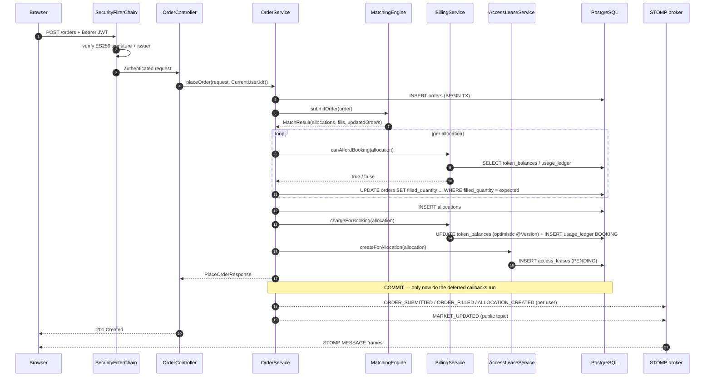

**Failure branches**

| Condition | Result |
| --- | --- |
| `startTime >= endTime`, or `endTime` in the past, or window > 24 h | 400 with an explanatory message |
| Buyer cannot fund their own match | 402; transaction rolls back; `MatchingEngine.rollback` unwinds every pending fill and removes the incoming order from the book |
| Resting counterparty cannot fund their share | That allocation is dropped, their fill compensated, their order stays in the book, `exgpu_booking_charge_failures_total`++ |
| `applyFill` matches 0 rows | That allocation is dropped and compensated; a warning is logged; no exception escapes |
| Concurrent balance update | `ObjectOptimisticLockingFailureException` → 409 "Concurrent update conflict — please retry" (no automatic retry) |

### 6.2 Fill an open demand request (provider side)

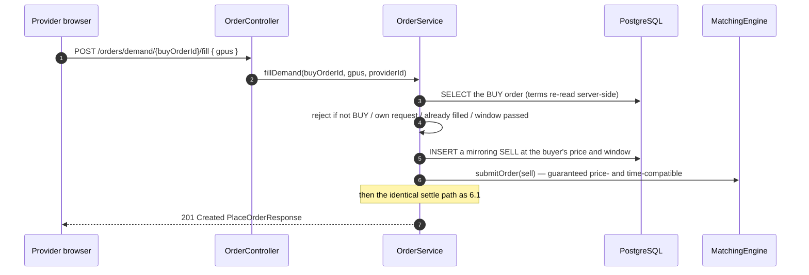

Two deliberate properties: the price and window come from the **stored** demand row, so a stale page cannot commit the provider to obsolete terms; and this path intentionally bypasses `validateWindow`, so a pre-existing demand whose window predates the 24-hour cap can still be filled (placement-time validation must not become retroactive through a side door).

### 6.3 Usage telemetry through Kafka

```text
External producer (not in this repo)
  ↓ produce to exgpu.usage-events   { eventId, allocationId, usageSeconds }
Kafka broker (single, group exgpu-billing-consumer)
  ↓ poll
UsageEventConsumer.consume(ConsumerRecord)
  ├─ record.value() == null  → DESERIALIZATION_FAILURE → DLQ, return
  └─ BillingService.submitUsageEvent(request)
       ├─ ledger lookup by eventId → present? mark duplicate, increment counter,
       │                              push DUPLICATE_USAGE_EVENT to that buyer, return
       └─ processNewEvent (inside the billing timer)
            ├─ load allocation (404 if missing)
            ├─ buyerId + executionPrice taken FROM THE ALLOCATION (422 if absent)
            ├─ cumulative cap: SUM(usage_seconds WHERE charge_type = USAGE)
            │                  + this event must fit the allocation window (400 otherwise)
            ├─ load balance (404 if missing)
            └─ INSERT usage_ledger { token_cost = 0, charge_type = USAGE, key = eventId }
  └─ any exception → DLQ { eventId, originalPayload, errorType, errorMessage, failedAt }
```

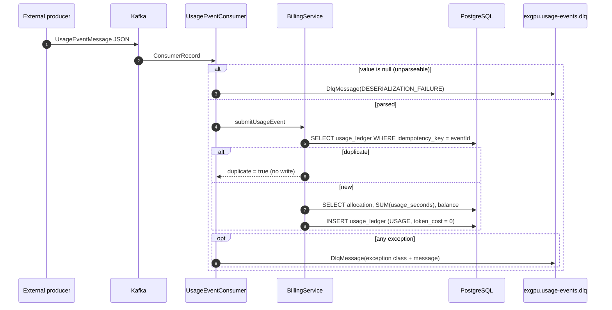

**Why `token_cost = 0` on USAGE rows.** Since migration `V4`, the billable unit is the booked window and the charge is taken up front. Metering rows are retained because they are the telemetry record the Kafka pipeline produces and they make booked-vs-actual utilisation observable — but deducting again would double-bill the same hours. The response still reports what the usage *would* have cost, for transparency.

### 6.4 Getting into a rental (access credential)

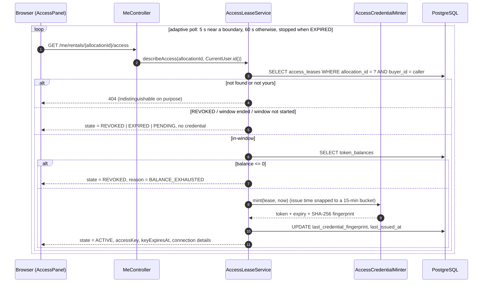

### 6.5 Cancelling a rental

```text
GET  /me/rentals/{id}/cancellation-quote   → read-only preview (tier, rate, charge, refund, notice)
POST /me/rentals/{id}/cancel               → one transaction:
   1. refund  = recorded BOOKING charge × RefundTier.rate   (FULL ≥8h, PARTIAL ≥4h, else NONE)
   2. allocation → CANCELLED, cancelled_at, refunded_amount
   3. releaseCapacity: SELL order's filled_quantity reduced, status recomputed,
                       and AfterCommit → MatchingEngine.restore(sellOrder)
   4. lease revoked (RevokeReason.OPERATOR), exgpu_access_leases_revoked_total++
   5. events: ACCESS_REVOKED to the buyer, MARKET_UPDATED to the seller and to /topic/market
   → returns the same CancellationQuote shape, now as a receipt
```

The buy order is deliberately **not** reopened: the buyer chose to cancel, and silently putting their demand back in the market would re-buy compute they just decided against.

### 6.6 Authentication

```text
Browser → supabase.auth.signInWithPassword(email, password)
        ← Supabase session { access_token (ES256 JWT), refresh_token }, stored in cookies
Browser → any ExGPU request with Authorization: Bearer <access_token>
API     → NimbusJwtDecoder: fetch JWKS (cached), verify ES256/RS256 signature,
          validate issuer = ${SUPABASE_URL}/auth/v1 and standard claims
API     → principal = Jwt;  CurrentUser.id() = UUID.fromString(jwt.sub)
API     → every service call is scoped by that UUID; nothing reads an owner id from a body
```

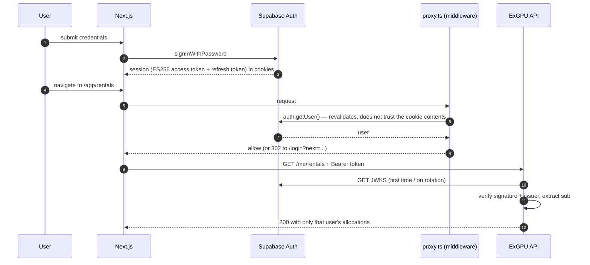

The middleware is a **routing convenience, not the security boundary** — its own Javadoc says so. Bypassing it yields a page whose every API call returns 401.

---

## 7. HTTP API reference

All routes are served by the single Spring Boot application on port 8080. "Auth" means a valid Supabase JWT in `Authorization: Bearer`; the security chain is **deny-by-default** (`anyRequest().authenticated()`), so anything not listed as public requires a token.

| Method | Route | Controller | Auth | Purpose |
| --- | --- | --- | --- | --- |
| POST | `/orders` | `OrderController` | Required | Place a BUY or SELL order; optionally a recurring SELL series |
| GET | `/orders/me?side=BUY\|SELL` | `OrderController` | Required | The caller's orders, newest priority first |
| GET | `/orders/{id}` | `OrderController` | Required | One order — 404 if it is not the caller's |
| GET | `/orders/{id}/allocations` | `OrderController` | Required | Allocations for an order the caller owns |
| DELETE | `/orders/{id}` | `OrderController` | Required | Cancel a resting order; on a `TEMPLATE` parent, cancel the whole series |
| POST | `/orders/demand/{buyOrderId}/fill` | `OrderController` | Required | Fill an open buy request with the caller's GPUs |
| GET | `/market/supply` | `MarketController` | **Public** | Rentable listings, cheapest first; personalised (own listings hidden) when a token is present |
| GET | `/market/demand` | `MarketController` | Required | Open buy requests a provider could fill, best-paying first |
| GET | `/me` | `MeController` | Required | `{ userId, email }` — lets the client confirm the token is accepted |
| GET | `/me/rentals` | `MeController` | Required | Allocations where the caller is the buyer |
| GET | `/me/supply` | `MeController` | Required | Allocations carved out of the caller's SELL orders |
| GET | `/me/balance` | `MeController` | Required | Prepaid balance; returns zero rather than 404 before the first top-up |
| GET | `/me/usage` | `MeController` | Required | The caller's billing history |
| GET | `/me/rentals/{allocationId}/access` | `MeController` | Required | Access state plus a credential while ACTIVE — designed to be polled |
| GET | `/me/rentals/{allocationId}/cancellation-quote` | `MeController` | Required | What cancelling now would refund; changes nothing |
| POST | `/me/rentals/{allocationId}/cancel` | `MeController` | Required | Cancel with a tiered refund; returns the resulting quote as a receipt |
| POST | `/balances` | `BalanceController` | Required | Credit the caller's own balance, creating it on first use |
| GET | `/balances/me` | `BalanceController` | Required | Same data as `GET /me/balance`, kept for API symmetry |
| GET | `/allocations` | `AllocationController` | Required | The caller's allocations — union of rentals and supply, de-duplicated |
| POST | `/usage-events` | `UsageEventController` | Required + party check | Submit a usage event for an allocation the caller is a party to |
| GET | `/usage-ledger` | `UsageEventController` | Required | The caller's own ledger rows |
| GET | `/actuator/health` | Actuator | **Public** | Liveness for the dashboard tile; `show-details: never` |
| GET | `/actuator/prometheus` | Actuator | **Public** | Metrics scrape |
| GET | `/swagger-ui.html`, `/swagger-ui/**`, `/v3/api-docs`, `/v3/api-docs/**` | springdoc | **Public** | Interactive API exploration |
| WS | `/ws` | `WebSocketConfig` | Public handshake, JWT at STOMP CONNECT | Realtime channel |

### Notable request/response shapes

**`POST /orders`** — `CreateOrderRequest`. There is deliberately **no `ownerId` field**; the owner is the verified `sub`.

```jsonc
{
  "side": "BUY",                    // required
  "pricePerGpuHour": 2.50,          // required, 0.0001 .. 999999.9999
  "quantity": 4,                    // required, 1 .. 1000000
  "startTime": "2026-09-03T09:00:00Z",
  "endTime":   "2026-09-03T17:00:00Z",
  "recurrence": {                   // optional; SELL only, else 400
    "pattern": "WEEKDAYS",          // DAILY | WEEKDAYS | WEEKLY
    "occurrences": 20,              // 2 .. 60 (also a DB CHECK constraint)
    "zoneId": "Europe/London"       // IANA zone; null defaults to UTC
  }
}
```

Response `201` — `PlaceOrderResponse`:

```jsonc
{
  "order": { "id": "...", "status": "PARTIALLY_FILLED", "filledQuantity": 2,
             "remainingQuantity": 2, "recurring": false, "parentOrderId": null, "...": "..." },
  "matchStatus": "PARTIAL_FILL",           // FULL_FILL | PARTIAL_FILL | NO_MATCH
  "totalMatchedQuantity": 2,
  "allocations": [ { "id": "...", "quantity": 2, "executionPrice": 2.40,
                     "lifecycle": "SCHEDULED", "windowSeconds": 28800, "maxCost": 115.20 } ]
}
```

Status codes: `201` created (including `NO_MATCH`, which still rests the order in the book), `400` validation or window rules, `401` no/invalid token, `402` the caller cannot fund their own match, `409` optimistic-lock conflict, `500` unexpected.

**`POST /usage-events`** — `SubmitUsageEventRequest`:

```jsonc
{ "eventId": "evt-0001",                    // idempotency key, ≤255 chars
  "allocationId": "8c0f...",                // UUID
  "usageSeconds": 1800 }                    // 1 .. 31,622,400
```

The payer and price are **not accepted** from the caller. `UsageEventController` additionally requires `allocationService.isPartyTo(allocationId, caller)` and returns 404 (not 403) otherwise, so the endpoint cannot be used to probe for valid ids. The Kafka path shares `BillingService` but has no authenticated principal — it is trusted by deployment, which is why the authorization check lives at the REST edge rather than in the service.

**`GET /market/supply`** — `SupplyListingResponse[]`, deliberately not `OrderResponse`:

```jsonc
[{ "listingId": "...", "pricePerGpuHour": 1.90, "availableGpus": 6,
   "windowStart": "...", "windowEnd": "...", "windowHours": 4,
   "estimatedCostPerGpu": 7.60 }]
```

No `ownerId`, no `status`, no `filledQuantity`, no `priorityTimestamp` — a browsing visitor sees the offer, not the order book's mechanics or who is behind it. `DemandListingResponse` is the mirror image for the provider side.

**`GET /me/rentals/{id}/access`** — one `AccessResponse` shape covers all four states; `accessKey` and `connection` are non-null **only** while `state = "ACTIVE"`.

### Endpoint-level authorization conventions

- **Owner-scoped 404s.** "Does not exist" and "is not yours" return the same 404 for orders, allocations, leases and cancellation quotes, so no endpoint can be used as an existence oracle.
- **No id parameters on `/me/*` list endpoints.** The subject is always the caller, so there is nothing for an attacker to substitute.
- **Removed by design.** `GET /balances/{ownerId}` and the exchange-wide `GET /allocations` / `GET /orders` were replaced by caller-scoped equivalents; the controllers document the removal in their Javadoc.
- **Unreachable service methods.** `OrderService.findAll()`, `OrderService.findOpen()` and `BillingService.findAllLedgerEntries()` return cross-user data and are marked operator-facing; **no controller exposes them**, verified by search.

---

## 8. gRPC / Protobuf contracts

**Not present.** There are no `.proto` files, no gRPC or protobuf dependencies in `pom.xml` or `package.json`, no generated stubs, and no code-generation plugin. All inter-process communication is REST/JSON, STOMP-over-WebSocket, Kafka JSON, or JDBC. The service boundaries that would justify gRPC (matching ↔ billing) are in-process method calls inside a single transaction, which is precisely why an RPC layer would add latency and failure modes without buying isolation.

---

## 9. Realtime architecture

### Destinations

| Destination | Audience | Carries | Publisher |
| --- | --- | --- | --- |
| `/user/queue/events` (broker-rewritten to `/user/{sub}/queue/events`) | Exactly one authenticated user's sessions | Orders, fills, allocations, billing, balance, access | `RealtimeEventPublisher.publishToUser` / `publishToUsers` |
| `/topic/market` | Every subscriber | `MARKET_UPDATED` only — a "the book moved" ping with **no payload and no identity** | `RealtimeEventPublisher.publishMarket` |

The split is a privacy decision, not a routing convenience: an order's fill and an allocation's terms reveal what someone is buying and at what price, so they only ever go to the parties on that trade. The public feed exists so an anonymous browse page can refresh itself.

### Event types

13 are declared in `RealtimeEventType`; **11 are actually published**:

| Event | Published from | Destination |
| --- | --- | --- |
| `MARKET_UPDATED` | `OrderService` (place, cancel), `CancellationService`, `OrderExpiryScheduler` | `/topic/market` (and once to a seller's own queue on cancellation) |
| `ORDER_SUBMITTED` | `OrderService.publishRealtime` | user |
| `ORDER_FILLED` | `OrderService.publishRealtime` (status `FILLED` only) | user |
| `ORDER_CANCELLED` | `OrderService.cancelOne` | user |
| `ORDER_EXPIRED` | `OrderExpiryScheduler.tick` | user |
| `ALLOCATION_CREATED` | `OrderService.publishRealtime` → buyer **and** seller | user (both parties) |
| `USAGE_BILLED` | `BillingService.chargeForBooking` | user |
| `BALANCE_UPDATED` | `BillingService` (top-up, charge, refund) | user |
| `DUPLICATE_USAGE_EVENT` | `BillingService.submitUsageEvent` | user |
| `ACCESS_GRANTED` | `AccessLeaseScheduler.tick` when a window opens | user |
| `ACCESS_REVOKED` | `BillingService` (KillCompute) and `CancellationService` | user |
| `COMPUTE_KILLED` | **declared, never published** | — |
| `DLQ_EVENT_CREATED` | **declared, never published** (deliberate: DLQ payloads have no safe recipient) | — |

### Event payload

```jsonc
{ "id": "uuid",                  // lets the UI de-duplicate and key lists
  "type": "ALLOCATION_CREATED",
  "message": "Allocation created for 2 GPU(s)",
  "entityId": "allocation-uuid",
  "payload": { /* DTO or null */ },
  "createdAt": "2026-09-02T01:09:24Z" }
```

### Connection lifecycle and client behaviour

1. `EventsProvider` mounts **only inside `/app`** (`src/app/app/layout.tsx`), so marketing and auth pages never open a socket.
2. No session → no socket; the effect clears both `connected` and the event list.
3. On connect, the client subscribes to `/user/queue/events` and `/topic/market`.
4. Personal events are prepended to a capped feed (`MAX_EVENTS = 200`) and raise a toast (max 4, auto-dismissed after 5 s).
5. Market events **only increment a `marketVersion` counter** — they are not personal activity, so they must not enter the feed or raise a toast. Pages watch that counter and refetch, which is how a listing someone else just took disappears without a manual reload.
6. Token rotation tears the client down and rebuilds it (`useEffect` keyed on `token`), so the socket is never left authenticated by a credential the client no longer holds.
7. Reconnect is `@stomp/stompjs`'s built-in 5 s retry; heartbeats are 10 s in both directions.

### Concurrency control in the realtime path

There is none, by design — the WebSocket is **output-only**. No `@MessageMapping` exists, so a client cannot send a business message; the `/app` application prefix is configured but unused. Ordering is per-destination best-effort, and every event is a notification about state that PostgreSQL already committed, so a dropped or reordered event costs a refresh, never correctness. Concurrency control for the data itself lives in the engine locks, the conditional UPDATEs, and `TokenBalance.@Version` (§17).

---

## 10. Data architecture

| Data type | Storage | Reason |
| --- | --- | --- |
| Orders, allocations, balances, ledger, leases | **PostgreSQL 16** | Relational integrity, FKs, CHECK constraints, transactions, and the ability to rebuild the in-memory book after a restart |
| The live order book and its 15-minute bucket index | **JVM heap** (`ConcurrentHashMap`) | Matching must not do I/O inside the lock path; the book is a derived, rebuildable projection of PostgreSQL |
| Usage telemetry in flight | **Kafka topic** `exgpu.usage-events` | Decouples producer rate from billing throughput; retains events the app cannot process yet |
| Unprocessable telemetry | **Kafka topic** `exgpu.usage-events.dlq` | Keeps one poison message from stalling the consumer, and preserves the payload for diagnosis |
| Identity (users, passwords, sessions) | **Supabase** (external) | The app holds no `users` table and never sees a password; `sub` is the canonical owner id |
| Time-series metrics | **Prometheus** | Scraped from `/actuator/prometheus`; retention is Prometheus's default (no override in Compose) |
| Viewer theme preference | **Browser `localStorage`** | Per-viewer convenience, applied pre-paint to avoid a flash |
| Supabase session | **Browser cookies** (`@supabase/ssr`) | So the Next.js middleware can see the session server-side |

### PostgreSQL

- **Ownership:** Flyway owns DDL; `spring.jpa.hibernate.ddl-auto=none` means Hibernate never alters the schema.
- **Connection pool:** HikariCP defaults (max pool size 10) — deliberately not raised, and called out in the design notes as the thing to watch now that virtual threads make it easy to have far more in-flight requests than connections.
- **Time zone:** `hibernate.jdbc.time_zone=UTC`; every timestamp column is `TIMESTAMPTZ`.
- **Money:** `NUMERIC(18,6)` for balances and ledger amounts, `NUMERIC(10,4)` for prices — never floating point, on either side of the wire.
- **`spring.jpa.open-in-view=false`**, so no lazy loading leaks outside a transaction.
- **SQL logging is off** deliberately, so ids and balances do not end up in logs.

### Object storage, search, vector stores

None. There is no S3/GCS/MinIO client, no Elasticsearch/OpenSearch, no vector database, and no file upload path anywhere in the repository.

---

## 11. Database schema

Six application tables, created and evolved by five Flyway migrations (plus Flyway's own `flyway_schema_history`).

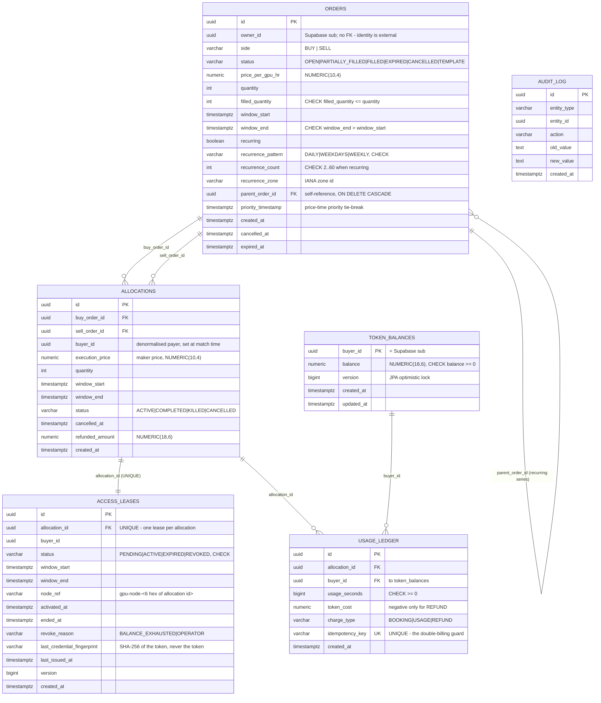

**`audit_log` is created by `V1` and never written to** — no entity, repository or query references it anywhere in the Java source.

### Indexes

| Index | Table | Purpose |
| --- | --- | --- |
| `idx_orders_matching (status, window_start, window_end)` | `orders` | The general lifecycle/window filter |
| `idx_orders_owner (owner_id)` | `orders` | "My orders" reads |
| `idx_orders_parent (parent_order_id) WHERE parent_order_id IS NOT NULL` | `orders` | Partial index for recurring-series children |
| `idx_orders_live_window_end (window_end) WHERE status IN ('OPEN','PARTIALLY_FILLED')` | `orders` | Partial index backing the expiry sweep and startup rehydration |
| `idx_allocations_buy_order`, `idx_allocations_sell_order` | `allocations` | Order → allocations lookups |
| `idx_allocations_cancelled (cancelled_at) WHERE cancelled_at IS NOT NULL` | `allocations` | Partial index — cancelled rows are the minority |
| `idx_usage_ledger_allocation`, `idx_usage_ledger_buyer`, `idx_usage_ledger_idempotency` | `usage_ledger` | Cumulative caps, per-user history, idempotency lookups |
| `idx_leases_status_start`, `idx_leases_status_end` | `access_leases` | The scheduler's two queries, both "status + a window boundary" |
| `idx_leases_buyer` | `access_leases` | "My rentals' access state" |

### Constraints that encode business rules

| Constraint | Meaning |
| --- | --- |
| `chk_window`, `chk_alloc_window`, `chk_lease_window` | A window must be non-degenerate |
| `chk_filled` | `filled_quantity <= quantity` — over-selling is impossible at the row level |
| `chk_balance` | `balance >= 0` — the final guard behind optimistic locking |
| `chk_token_cost` | Negative amounts **only** on `REFUND` rows; a sign error in a charge path fails loudly |
| `chk_usage_seconds` | `>= 0` — a refund row legitimately records zero seconds |
| `chk_charge_type` | `BOOKING`, `USAGE` or `REFUND` |
| `chk_recurrence_shape` | Either not recurring with no pattern/count, or recurring with a pattern and a count in `[2, 60]` |
| `chk_recurrence_pattern` | `DAILY`, `WEEKDAYS` or `WEEKLY` |
| `usage_ledger.idempotency_key UNIQUE` | The last line of defence against double billing |
| `access_leases.allocation_id UNIQUE` | Makes lease creation idempotent under concurrency |

### Migration history

| Migration | What it did |
| --- | --- |
| `V1__init_schema.sql` | `orders`, `allocations`, `token_balances`, `usage_ledger`, `audit_log`; the core CHECKs, FKs and indexes |
| `V2__allocation_billing_fields_and_usage_rename.sql` | Added `allocations.buyer_id` and `execution_price` so an allocation is a **self-contained billing record**; renamed `gpu_seconds` → `usage_seconds` (the old name implied count × time, which would have double-counted the GPU dimension) |
| `V3__access_leases.sql` | The `access_leases` table plus a backfill for allocations created before it; explicitly stores no credential |
| `V4__booking_billing_and_cancellation.sql` | Moved billing from metered usage to the booked window: `charge_type`, a widened `token_cost` CHECK allowing negative refunds, and cancellation columns. Existing allocations are deliberately **not** retro-charged |
| `V5__order_lifecycle_and_recurring_series.sql` | Recurring series (`parent_order_id`, `recurrence_count`, `recurrence_zone` + CHECKs) and the previously unreachable lifecycle timestamps `cancelled_at` / `expired_at`, plus the partial index for the sweep |

### Order status state machine

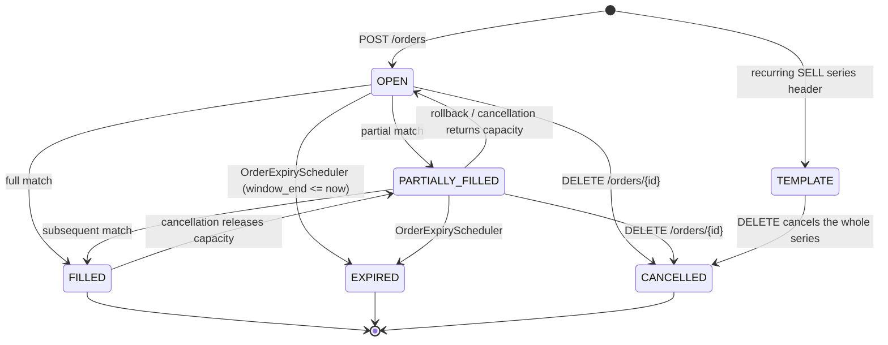

`TEMPLATE` is a sixth status beyond the five in `CLAUDE.md`, and the deviation is documented in `OrderStatus`'s Javadoc: a template never enters the book, never matches and is never billed, and because every book/market query already filters on `OPEN`/`PARTIALLY_FILLED`, it is excluded from matching, listings and rehydration **with zero query changes**. The alternative considered was a separate `order_series` table.

### Lease state machine

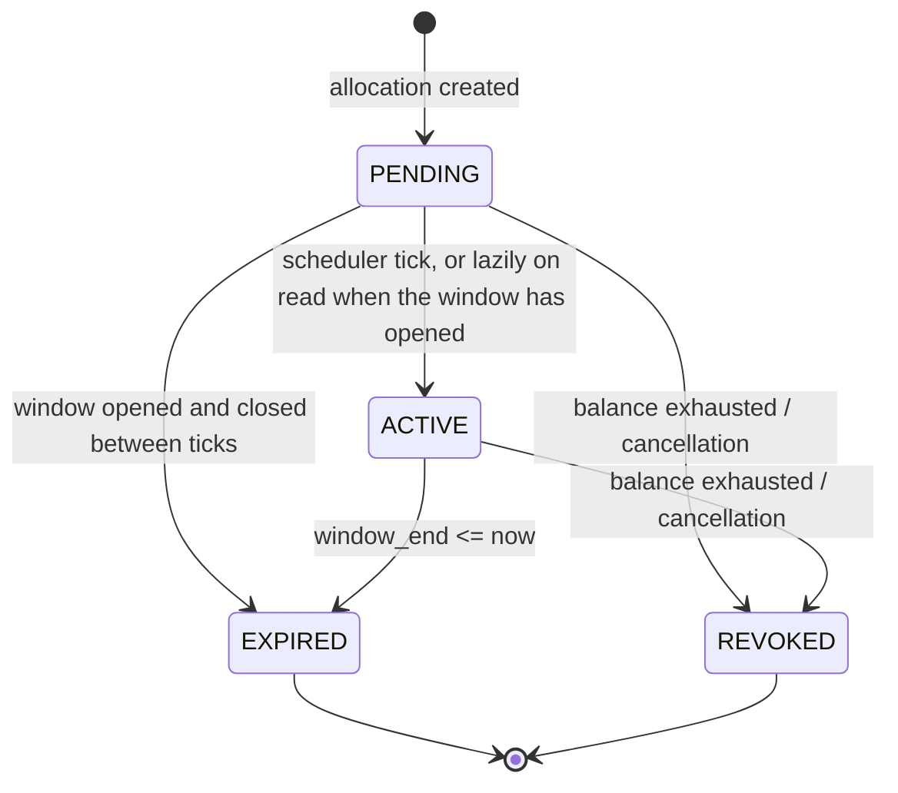

---

## 12. Caching architecture

**There is no application cache.** Specifically:

- No Spring Cache abstraction (`@EnableCaching`, `@Cacheable`) anywhere.
- Redis is provisioned in Compose and on the classpath but its autoconfiguration is explicitly excluded, and no code uses a Redis API.
- No HTTP response caching — the opposite, in fact: `SecurityHeadersFilter` sets `Cache-Control: no-store` on **every** response so balance and billing data never lands in an intermediary or browser cache, and the frontend's `fetch` wrapper passes `cache: "no-store"`.

Three things do act as caches in the loose sense and are worth naming precisely:

| Mechanism | What it holds | Invalidation |
| --- | --- | --- |
| The in-memory order book | The live book, as a projection of `orders` | Written through on every mutation; rebuilt wholesale at startup; compensated on rollback |
| `NimbusJwtDecoder`'s JWKS cache | Supabase signing keys | Managed by Spring Security / Nimbus; refetched on key rotation |
| The credential time bucket | A byte-identical credential per 15-minute bucket | Rolls over with the bucket; not stored server-side |

The absence of a cache is defensible at the current scale: the hot read path (`/market/supply`) is a single indexed query over an order book that the design notes measured at **15 live orders** in the local database.

---

## 13. Authentication and authorization

### Identity provider

Supabase Auth owns identity. There is **no `users` table, no password handling, and no credential storage** in this application. The frontend signs in with `supabase-js`; the backend is a pure OAuth2 **resource server**.

### Token validation

`SecurityConfig.jwtDecoder()` builds a `NimbusJwtDecoder` from `${SUPABASE_URL}/auth/v1/.well-known/jwks.json` with two deliberate choices:

- **Explicit algorithm list `{ES256, RS256}`.** `withJwkSetUri` defaults to RS256 only, while Supabase signs with ES256 — without this, every genuine token fails with an error that looks exactly like a bad token rather than a misconfiguration. RS256 is accepted alongside because older/legacy Supabase projects issue it and a project can be migrated between the two. The list is a whitelist, so `none` and weaker algorithms cannot be negotiated.
- **Issuer validation** via `JwtValidators.createDefaultWithIssuer(issuer)` — a correctly-signed token from a *different* Supabase project cannot be replayed against this API.

The public JWKS is the only key material the backend needs; there is no shared JWT secret anywhere in the configuration.

### Authorization model

| Layer | Mechanism |
| --- | --- |
| Chain | Deny-by-default: `anyRequest().authenticated()` after a short public allowlist |
| Public allowlist | `OPTIONS /**` (preflights), `/actuator/health`, `/actuator/prometheus`, `GET /market/**`, Swagger/OpenAPI paths, `/ws/**` (authenticated at the STOMP frame instead) |
| Principal | `CurrentUser.id()` → `UUID.fromString(jwt.sub)`. 401 if there is no JWT or no subject; **500** if the subject is not a UUID, because that is a Supabase misconfiguration rather than a client error |
| Optional identity | `CurrentUser.idOrNull()` for endpoints that are public but personalise — `/market/supply` hides your own listings from you |
| Ownership enforcement | In services: `filter(o -> ownerId.equals(o.getOwnerId()))` on orders; `buyerId` equality on leases and cancellations; `AllocationRepository.isPartyTo` for usage events; `findBySellerId` resolves the seller through the SELL order |
| Roles / scopes | **None.** There is no `@PreAuthorize`, no `ROLE_*`, and no service-account role. Authorization is uniformly "the caller must own or be a party to this resource" |
| WebSocket | Per-user destinations; the broker delivers `/user/{principal}/queue/events` only to matching sessions |

The working-tree-only `SECURITY.md` (gitignored, so not part of a clone) still describes authentication as a milestone that is "scoped, not built" — that document predates the work and is stale. Authentication, per-user REST scoping and per-user WebSocket destinations are all **implemented**; what remains unbuilt from that plan is the service/telemetry role, TLS termination and rate limiting.

---

## 14. Security model

### Implemented controls

| Area | Control | Where |
| --- | --- | --- |
| Network exposure | The app binds `127.0.0.1` by default; **every** Compose host port is bound to `127.0.0.1` (Postgres, Redis, Kafka, Prometheus, Grafana) | `application.properties`, `docker-compose.yml` |
| Authentication | Supabase ES256/RS256 JWT, issuer-validated, deny-by-default chain | `SecurityConfig` |
| Authorization | Owner/party scoping in every service; identical 404 for "missing" and "not yours" | `OrderService`, `AllocationService`, `AccessLeaseService`, `CancellationService` |
| Identity integrity | The owner is never read from a request body — `CreateOrderRequest` and `CreateBalanceRequest` have no `ownerId` field at all | `dto/`, `config/CurrentUser.java` |
| Input validation | Typed and bounded: price `0.0001..999999.9999`, quantity `1..1,000,000`, top-up `≤999,999,999,999.999999` (matching the column), `usageSeconds 1..31,622,400` (also prevents a `long` overflow in the cumulative check), `eventId ≤255` chars | `dto/` |
| Error hygiene | `include-stacktrace=never`, `include-exception=false`, `include-message=never`; the catch-all handler logs server-side and returns an opaque 500 | `application.properties`, `GlobalExceptionHandler` |
| Response headers | `nosniff`, `X-Frame-Options: DENY`, `Referrer-Policy: no-referrer`, `Cache-Control: no-store` on every response | `SecurityHeadersFilter` |
| SQL injection | 100% parameterised — Spring Data derived queries plus named-parameter JPQL; path variables are typed `UUID` and a bad value yields a generic 400 | `repository/`, `GlobalExceptionHandler` |
| Actuator surface | Only `health` and `prometheus` exposed; `show-details: never`, `show-components: never`, `info.env.enabled=false` | `application.properties` |
| WebSocket | Origin pinned; token verified at CONNECT; per-session limits (16 KB frame, 512 KB buffer, 15 s send); **no `@MessageMapping`**, so there is no client→server injection path | `WebSocketConfig`, `WebSocketAuthChannelInterceptor` |
| Credential handling | Tokens are minted, never stored; only a SHA-256 fingerprint is persisted; verification uses a constant-time comparison; rotating `ACCESS_SIGNING_SECRET` invalidates every outstanding credential immediately | `AccessCredentialMinter`, `V3` migration |
| CSRF | Disabled deliberately and correctly: the API is stateless and token-authenticated, with no cookie for a cross-site request to ride on | `SecurityConfig` |
| Frontend CSP | `default-src 'self'`; `connect-src` pinned to self + the configured API + WS + Supabase origins; `object-src 'none'`; `frame-ancestors 'none'`; `base-uri 'self'`; `form-action 'self'`; `Permissions-Policy` disables camera/mic/geolocation/topics; `poweredByHeader: false` | `frontend/next.config.mjs` |
| Frontend XSS posture | React escapes all rendered values; no `dangerouslySetInnerHTML` except the tiny inline theme script authored in-repo | `src/app/layout.tsx` |
| Secrets | `.env` is gitignored, `.env.example` is committed with `change-me` placeholders; Grafana anonymous access and sign-up are disabled | `.gitignore`, `.env.example`, `docker-compose.yml` |
| Production config guard | A non-development `next build` **throws** if any of the five required `NEXT_PUBLIC_*` variables is missing | `next.config.mjs` |

### Security considerations and gaps

Each of these is visible in the repository; none is speculative.

1. **Plaintext transport.** Everything is HTTP and `ws://`. Acceptable on loopback; TLS termination is required before any network exposure. No reverse-proxy or certificate configuration exists here.
2. **No rate limiting or quotas.** Nothing throttles order placement, top-ups, usage events or access polling. A single authenticated account can flood the matching path.
3. **Hard-coded CORS/WebSocket origin.** `http://localhost:3001` is a `private static final String` in both `SecurityConfig` and `WebSocketConfig`. Deploying anywhere else requires a code change, not configuration — an obvious externalisation candidate.
4. **A dev-default HMAC signing key.** `exgpu.access.signing-secret` falls back to `dev-only-insecure-access-signing-key-change-me`. It is a genuine shared secret (a node would verify with it), so shipping the default would make every access credential forgeable. The property is documented as override-before-non-local-use, but nothing enforces that at startup.
5. **Kafka has no authentication or ACLs**, and the DLQ message stores the **raw original payload** plus exception text. It is not broadcast (that was a conscious fix), but anyone with broker access can read it.
6. **The telemetry trust boundary is deployment-shaped.** The Kafka consumer has no principal and is trusted implicitly; the REST doorway allows *either* party to an allocation to report usage, which the controller Javadoc acknowledges is broader than a production design would allow (only a provider agent should hold that credential).
7. **No account lockout, MFA, or password policy** — all delegated to Supabase, so the posture is whatever the Supabase project is configured for.
8. **No audit trail in practice.** `audit_log` exists in the schema but nothing writes to it; the effective audit trail is application logs plus the immutable `usage_ledger`.
9. **The frontend CSP allows `'unsafe-inline'` styles and scripts** (and `'unsafe-eval'` in development). Tightening to nonces or hashes is listed as future work in `SECURITY.md` and remains undone.
10. **`server.address` can be widened to `0.0.0.0`** by one environment variable, which is exactly what is needed for containerised Prometheus scraping — a documented foot-gun with a warning comment beside it.

---

## 15. AI / agent architecture

**None.** There is no LLM provider SDK, no agent framework, no MCP server or client, no RAG pipeline, no embedding model, no vector store, and no prompt anywhere in the repository. The dependency lists in `pom.xml` and `package.json` contain no AI/ML libraries. The word "agent" appears in the codebase only in the roadmap sense of a future *provider node agent* that would provision containers and verify access credentials — described in `CLAUDE.md`'s SSH roadmap, and unimplemented.

---

## 16. Algorithms

### 16.1 Three-dimensional continuous matching

**Location:** `MatchingEngine.runMatch`.

**Inputs:** an incoming order `I` with `(side, price, quantity, window)`, plus the resting counter-side book.
**Output:** a list of `Allocation`s, a parallel list of `Fill`s, and the mutated orders.

```text
1. Gather candidates
     C ← ⋃ { counterBuckets[b] : b ∈ bucketRange(I.window) },  deduplicated by id
2. Filter
     c.isMatchable()                                   status ∈ {OPEN, PARTIALLY_FILLED}
     c.ownerId ≠ I.ownerId                             self-trade prevention
     priceCompatible(I, c)                             buy.price ≥ sell.price
     c.window.overlaps(I.window)                       CLOSED intervals on both ends
3. Sort
     primary   : best price first   (ascending for a BUY taker, descending for a SELL taker)
     secondary : c.priorityTimestamp ascending          → price-time priority
4. Sweep, until I is exhausted
     under c's tier-2 lock:
       re-check c.isMatchable()                        the linchpin re-check
       q ← min(I.remaining(), c.remaining())
       w ← I.window ∩ c.window                         the traded window
       I.filled += q ; c.filled += q ; recomputeStatus() on both
       if c is no longer matchable → remove from counterBook and from every bucket
       emit Allocation{buyOrderId, sellOrderId, buyerId, executionPrice = c.price, q, w}
       emit Fill{orderId, order, quantityBefore, quantityFilled, newStatus, allocation}
5. If I still has remaining quantity → insert I into its own book and bucket index
```

**Properties**

- **Execution price is the maker's price.** The candidate was already resting when the taker arrived, so the trade clears at the resting price — the standard limit-order-book rule, and the reason `executionPrice` is captured on the allocation rather than recomputed later.
- **The traded window is the intersection**, so a 1-hour buy against an 8-hour listing produces a 1-hour allocation, not an 8-hour one.
- **`overlaps` is closed on both ends** — windows that merely touch at an instant count as overlapping. This is load-bearing: the bucket span in the lock manager is deliberately widened to match it (§16.2).
- **Complexity:** with `k` = candidates in the touched buckets, the sweep is `O(k log k)` for the sort plus `O(k)` for the scan. Bucket partitioning is what keeps `k` at "orders overlapping this window" instead of "every resting order". A price-level index was explicitly deferred (design note D12) with measurable revisit triggers: book depth above ~5,000 per side, or `exgpu_matching_latency_seconds` p99 above ~5 ms.
- **The matching path is clock-free.** `isMatchable()` never consults `Instant.now()`; expiry is exclusively the sweep's job. That is what lets the unit tests pin windows to a fixed date without every case becoming instantly unmatchable.

### 16.2 Two-tier striped locking over time buckets

**Location:** `TimeSliceLockManager`, used when `exgpu.matching.striped=true` (the production default).

```text
BUCKET_SECONDS = 900                                    (15 minutes, epoch-aligned)
bucketOf(t)    = floorDiv(t.epochSecond, 900)           floorDiv, so pre-epoch instants floor correctly
bucketRange(w) = [bucketOf(w.start) .. bucketOf(w.end)] INCLUSIVE at both ends

tier 1 (time)  : stripe = bucket & (1024 - 1)           MASKED, not hashed
tier 2 (order) : stripe = orderId.hashCode() & (512 - 1) HASHED — UUIDs are not contiguous
```

**Why two tiers.** A per-bucket lock alone is unsound, and the counterexample is concrete: a resting SELL spanning 09:00–15:00 covers roughly two dozen buckets. Two BUYs over **disjoint sub-ranges of that span** — the first half-hour and the last half-hour — share none of each other's buckets, only the SELL's. Each locks only *its own* buckets, both see the SELL as matchable, both compute `matchedQty` against the same pre-mutation remaining quantity, and both apply it. The SELL is over-sold with no bucket lock ever violated. **The bucket is not the shared resource; the resting maker is.** Tier 2 plus the re-check under it is what closes this.

**Why masking, not hashing, for tier 1.** Bucket keys within one window are contiguous, so masking maps a span of at most 1024 buckets onto *distinct* stripes — an order's own span never self-collides. Hashing would scatter a contiguous span pseudo-randomly and could collide it against itself, inflating the held-lock count for no benefit.

**Why the bucket span is deliberately one bucket too wide.** `bucketRange` includes the end bucket even when a window ends exactly on a boundary, because `TimeWindow.overlaps` is closed. A half-open span would under-lock exactly the touching-window pairs and let a match proceed with one of its buckets unheld. **Rule: the bucket span must never be narrower than the overlap predicate it protects.**

**Deadlock-freedom argument.** Tier-1 stripes are acquired in ascending, de-duplicated index order (`stripesFor` sorts and dedupes), which is the standard total-order argument — no cycle can form. At most one tier-2 lock is held at a time, always at the leaf, never while waiting on anything else. The two tiers are separate fixed arrays, so no single `ReentrantLock` is ever both. `MatchingEngineConcurrencyTest` covers this with a deterministic `tryLock` demonstration plus a 10,000-iteration soak under `assertTimeoutPreemptively`.

**Why fixed arrays rather than a `Map<Long, Lock>`.** Lock reclamation becomes a non-problem instead of a solved problem — reference-counted per-bucket locks are a classic source of acquire/release/refcount races. The accepted cost is false contention between unrelated buckets sharing a stripe, which is correctness-neutral.

**Why `ReentrantLock` rather than `synchronized`.** On Java 21 (pre-JEP 491), a virtual thread blocking on a monitor **pins its carrier thread**; a `ReentrantLock` parks the virtual thread and frees the carrier. Removing the `synchronized` was therefore the precondition for turning on `spring.threads.virtual.enabled=true`, and the ordering is called out in `application.properties`.

### 16.3 Recurrence expansion

**Location:** `RecurrenceExpander.expand(firstStart, firstEnd, pattern, occurrences, zone)` — a pure static function with no clock, no Spring and no I/O.

```text
zStart, zEnd      ← firstStart/firstEnd in the caller's IANA zone
startTime,endTime ← their LOCAL times
endDayOffset      ← days between the local start and end dates (0 normally, 1 for overnight)
stepDays          ← 7 for WEEKLY, otherwise 1
cursor            ← the local start date
while produced < occurrences:
    if pattern = WEEKDAYS and cursor is Sat/Sun → skip WITHOUT consuming an occurrence
    else emit TimeWindow(ZonedDateTime(cursor, startTime, zone),
                         ZonedDateTime(cursor + endDayOffset, endTime, zone))
    cursor += stepDays
```

**Why wall-clock rather than a fixed `Duration`.** "Every weekday 09:00–17:00" is a wall-clock concept. Advancing the UTC instant by `Duration.ofDays(1)` shifts every occurrence by an hour across a DST boundary, so a multi-week series lists the wrong hours after the transition. Expanding through `ZonedDateTime` + `LocalTime` in the seller's zone keeps every occurrence at the same local time. `RecurrenceExpanderTest` covers a real `Europe/London` March transition.

**Bounds:** `occurrences ∈ [2, 60]` — validated in the DTO (`@Min`/`@Max`), re-checked inside the expander, and enforced by the `chk_recurrence_shape` CHECK constraint. The series envelope must also fit within `exgpu.orders.max-horizon-days` (90), which is injected into `OrderService`.

### 16.4 Billing arithmetic

```text
cost(seconds, gpus, price) = (BigDecimal(seconds) / 3600  [scale 10, HALF_UP])
                             × gpus × price
                             → setScale(6, HALF_UP)

booking charge = cost(windowSeconds, allocation.quantity, allocation.executionPrice)
refund         = recordedBookingCharge × tier.rate    → setScale(6, HALF_UP)
```

Refunds are computed from the **recorded charge**, not by recomputing the cost — if pricing logic ever changes, a refund must still return money against what the buyer actually paid.

### 16.5 Refund tiers

| Tier | Notice to **window start** | Rate |
| --- | --- | --- |
| `FULL` | ≥ 8 hours | 1.00 |
| `PARTIAL` | ≥ 4 hours and < 8 hours | 0.50 |
| `NONE` | < 4 hours, or the window has already started | 0.00 |

Notice is measured to the start of the window, not from the moment of booking, because a cancellation costs the provider more the later it lands: hours pulled off the market at short notice are unlikely to be resold. `RefundTierTest` covers all nine boundary cases.

### 16.6 Access credential minting

```text
ttl          = 15 minutes
bucketStart  = floorDiv(now.epochSecond, ttl) × ttl        ← snap DOWN: idempotent polling
expiry       = bucketStart + 2 × ttl                       ← two buckets out, so a token minted
               clamped to lease.windowEnd                     late in a bucket still lives a full TTL
payload      = leaseId | allocationId | buyerId | nodeRef | expiryEpochSeconds
token        = "exgpu_v1" . base64url(payload) . base64url(HMAC-SHA256(key, base64url(payload)))
fingerprint  = hex(SHA-256(token))                         ← the only thing persisted
```

Verification checks the prefix, recomputes the HMAC, compares with `MessageDigest.isEqual` (constant time), then checks the embedded expiry — an offline check requiring no callback to this service and no credential table to leak.

### 16.7 Client-side browse filtering

`frontend/src/lib/browse.ts` implements chip predicates (availability, size band, duration, price band), a `maxPrice`/`minGpus` filter and four sort keys (`price`, `gpus`, `soonest`, `duration`) over one shape-agnostic `Browsable` projection, so buyers browsing supply and providers browsing demand cannot drift apart in what "soon", "short" or "cheap" mean. It runs client-side over the full list the API already returned — honest at tens of listings, and the file itself says this belongs in the query if the book grows past a few hundred.

---

## 17. Concurrency and consistency

### Concurrency mechanisms in use

| Mechanism | Protects | Location |
| --- | --- | --- |
| Tier-1 striped `ReentrantLock[1024]` over 15-min buckets | Book **structure** — the bucket index and insertion | `TimeSliceLockManager.acquire` |
| Tier-2 striped `ReentrantLock[512]` keyed by order id | Mutation of one specific resting maker | `TimeSliceLockManager.orderLock` |
| Single engine-wide `ReentrantLock` | The fallback mode (`striped=false`), functionally the old `synchronized` | `MatchingEngine.submitSingleLocked` |
| `ConcurrentHashMap` + `computeIfAbsent` / `computeIfPresent` | Atomic bucket insert/remove-and-delete-if-empty | `MatchingEngine.registerBuckets` / `unregisterBuckets` |
| JPA `@Version` optimistic locking | `token_balances.balance`, `access_leases` | `TokenBalance`, `AccessLease` |
| Conditional bulk `UPDATE` (`WHERE` includes the state being left) | Counterparty fills, order expiry, lease transitions, lease revocation | `OrderRepository`, `AccessLeaseRepository` |
| Unique constraints | `usage_ledger.idempotency_key`, `access_leases.allocation_id` | `V1`, `V3` |
| CHECK constraints | `balance >= 0`, `filled_quantity <= quantity` | `V1` |
| Transaction synchronisation | Deferring in-memory and notification side effects to after commit | `AfterCommit`, `OrderService.registerCompensatingRollback` |

### The consistency model, stated plainly

- **PostgreSQL is authoritative.** The order book is a derived projection that can always be rebuilt from it.
- **Within a placement, the DB writes are one transaction** — allocations, counterparty fills, the balance deduction, the ledger row and the lease all commit or none do.
- **The engine is not transactional**, which is the central tension. It is reconciled three ways: (1) a compensating rollback registered on the transaction synchronisation, replaying `MatchResult.fills` in reverse; (2) `AfterCommit` for every in-memory mutation that must not precede its DB write (cancellation removal, capacity restoration); (3) startup rehydration from PostgreSQL as the ultimate reconciler.
- **Book ↔ DB divergence is detected, not assumed away.** `applyFill` guards on both `id` and the pre-fill quantity, so a stale book yields a rowcount of 0 — a *detected* divergence that drops the allocation — rather than a silent lost update.
- **Idempotency is the ordering-independence strategy.** Every scheduled transition and every billing write is expressed so that running it twice, late, or concurrently from two instances is a no-op the second time.

### Known races, and what actually guards them

| Race | Guard |
| --- | --- |
| Two takers matching the same resting maker across disjoint buckets | Tier-2 order lock + `isMatchable()` re-check under it (`MatchingEngineConcurrencyTest.crossBucketHazard`, 500 iterations, both engine modes) |
| Two concurrent placements by the same buyer both passing `canAffordBooking` | Accepted and documented. The guards are `TokenBalance.@Version` → 409 and `chk_balance CHECK (balance >= 0)`. It is not closed in the pre-check because `canAffordBooking` must be non-throwing: `chargeForBooking` is `@Transactional(REQUIRED)`, so throwing from it would mark the shared transaction rollback-only and catching the exception locally would still doom the commit with `UnexpectedRollbackException` |
| Duplicate telemetry (retry, at-least-once redelivery) | Ledger lookup by `eventId`, backed by the UNIQUE constraint |
| Double charge for one booking | `booking:<allocationId>` idempotency key |
| Two schedulers ticking concurrently | Conditional UPDATEs — the database serialises them and the loser matches zero rows |
| Concurrent lease creation for one allocation | `access_leases.allocation_id UNIQUE` |
| A rolled-back transaction leaving a phantom fill in the book | `MatchingEngine.rollback` via `afterCompletion`; **not crash-safe**, bounded by startup rehydration |
| A stale lease status between scheduler ticks | The read path re-evaluates the window rather than trusting the stored status |

### Virtual threads

`spring.threads.virtual.enabled=true`. Every servlet request, and Spring's `TaskExecutor`/`TaskScheduler`, run on virtual threads; Kafka listener containers keep their own executor and are unaffected. Two consequences are documented in the configuration itself: the `synchronized` → `ReentrantLock` change was a **precondition** (a monitor pins the carrier on Java 21), and the bottleneck moves to HikariCP's 10-connection default pool, which is why `hikaricp_connections_pending` is the metric to watch.

---

## 18. Asynchronous processing

### Kafka consumer

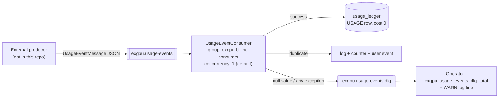

- **Retry behaviour:** none configured. There is no `RetryTemplate`, `DefaultErrorHandler` backoff, or retry topic — the first failure goes straight to the DLQ. That is a deliberate simplification (fail fast, keep the payload, alert on the counter), not an oversight to gloss over: a transient database blip will DLQ an event that would have succeeded on a retry.
- **DLQ consumption:** nothing consumes `exgpu.usage-events.dlq`. It is a durable parking lot inspected manually.
- **Acknowledgement:** listener-container defaults — `ackMode` BATCH, with Spring Kafka overriding `enable.auto.commit` to false because nothing sets it explicitly — so offsets are committed after the listener returns. Since the listener swallows every exception, offsets always advance.

### Scheduled jobs

| Job | Cadence | Work | Idempotency |
| --- | --- | --- | --- |
| `AccessLeaseScheduler.tick` | `fixedDelay = 15 s`, `initialDelay = 5 s`, `@Transactional` | `activateDueLeases(now)` then `expireEndedLeases(now)`, in that order — expiring first would let a lease that opened and closed within one tick be activated afterwards and stranded `ACTIVE` past its end. Emits `ACCESS_GRANTED` per newly-opened lease, and lease counters | Every transition is a conditional UPDATE whose WHERE includes the source state; `activated_at`/`ended_at` use `COALESCE` so a replay cannot rewrite the original timestamp |
| `OrderExpiryScheduler.tick` | `fixedDelay = 60 s`, `initialDelay = 10 s`, `@Transactional` | `MatchingEngine.expireBefore(now)` (in-memory) and `OrderRepository.expirePastWindows(now)` (DB) — two independent halves, neither depending on the other's output. Emits `ORDER_EXPIRED` per removed order plus one `MARKET_UPDATED` | Same conditional-UPDATE idiom |
| `OrderBookRehydrator.rehydrate` | Once, on `ApplicationReadyEvent` | Loads `OPEN` + `PARTIALLY_FILLED` orders ordered by `priorityTimestamp` ascending (preserving price-time priority), skips already-past windows, and inserts them **without matching** | `MatchingEngine.restore` overwrites an id with itself, so re-running is harmless |

`fixedDelay` rather than `fixedRate` in both schedulers: if a tick runs long, delay spaces the next one out instead of queueing overlapping executions against the same rows.

**Why the rehydrator exists** — from its own Javadoc, and worth quoting because it is a measured observation rather than a hypothetical: after 13 minutes of uptime with `exgpu_orders_submitted_total = 0`, the database held 11 `OPEN` and 4 `PARTIALLY_FILLED` orders while the in-memory book was empty and `/market/supply` kept advertising that supply. Every restart silently emptied the book.

### Job status tracking

There is no job table, cursor or watermark anywhere. That is the point: because every tick is expressed against absolute window boundaries rather than "what changed since last time", there is no state to lose and nothing to recover after a crash.

---

## 19. Infrastructure

### What exists

All infrastructure in this repository is **local development infrastructure**: one Docker Compose file plus Prometheus and Grafana configuration. There is **no** Terraform, CDK, CloudFormation, Pulumi, Kubernetes manifest, Helm chart, ECS task definition, Lambda handler, or cloud provider SDK anywhere in the tree. Nothing here deploys to AWS, GCP or Azure, and no such intent is expressed in code.

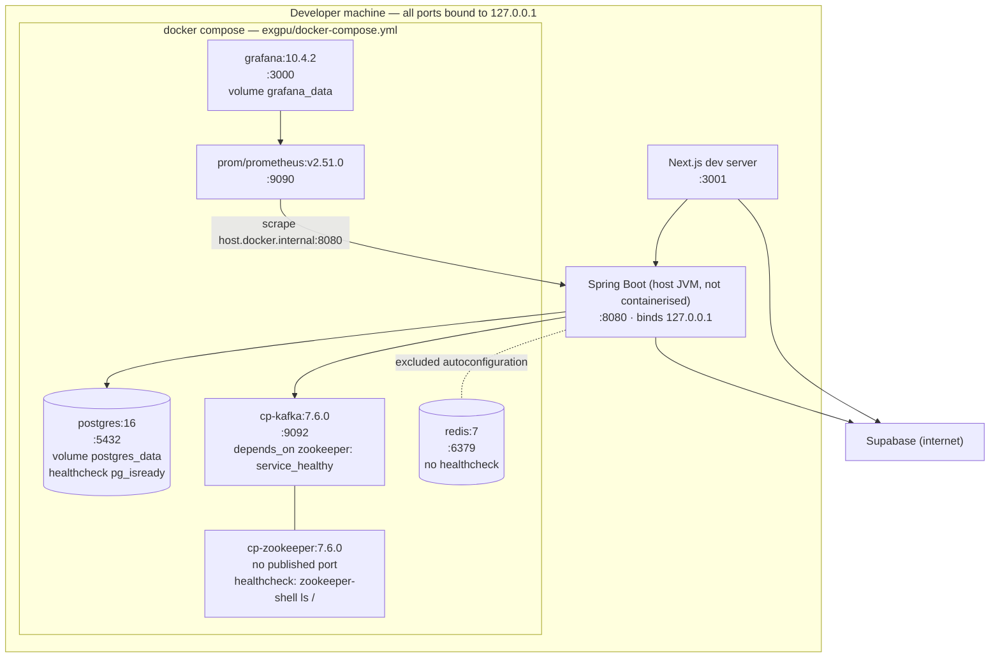

### Compose service details

| Service | Image | Host port | Restart | Healthcheck | Volume |
| --- | --- | --- | --- | --- | --- |
| `postgres` | `postgres:16` | `127.0.0.1:5432` | `unless-stopped` | `pg_isready -q`, 10 s interval, 30 s start period (initdb is slow on a fresh volume) | `postgres_data` |
| `redis` | `redis:7` | `127.0.0.1:6379` | `unless-stopped` | none | none |
| `zookeeper` | `confluentinc/cp-zookeeper:7.6.0` | **not published** | `unless-stopped` | `zookeeper-shell localhost:2181 ls /` — deliberately not the `ruok` four-letter word, which ZooKeeper 3.5+ refuses unless whitelisted and this image does not translate the whitelist env var | none |
| `kafka` | `confluentinc/cp-kafka:7.6.0` | `127.0.0.1:9092` | `unless-stopped` | none; `depends_on: zookeeper: condition: service_healthy` | none |
| `prometheus` | `prom/prometheus:v2.51.0` | `127.0.0.1:9090` | `unless-stopped` | none | config bind-mount, read-only |
| `grafana` | `grafana/grafana:10.4.2` | `127.0.0.1:3000` | `unless-stopped` | none | `grafana_data` + read-only provisioning mounts |

**Design notes recorded in the file itself:** `restart: unless-stopped` rather than `always`, so an explicit `docker compose stop` stays stopped instead of resurrecting at next boot; healthchecks plus `service_healthy` because on a reboot everything starts at once and Kafka regularly loses the race against ZooKeeper; `postgres_data` survives `docker compose down` but **not** `down -v`.

### What is not containerised

The Spring Boot application and the Next.js frontend both run **on the host**. There is no `Dockerfile` for either, no `spring-boot:build-image` invocation, and no application service in the Compose file — which is exactly why Prometheus scrapes `host.docker.internal:8080` and why `SERVER_ADDRESS` carries a warning about widening the bind for container-based scraping.

---

## 20. Containerization

| Question | Answer |
| --- | --- |
| Dockerfiles in the repository | **None.** Zero `Dockerfile`s for the app, the frontend, or anything else |
| Multi-stage builds | N/A |
| Container registry | None referenced |
| Compose files | One: `exgpu/docker-compose.yml` — six dependency services, no application service |
| Networks | The Compose default bridge network; services address each other by service name (`zookeeper:2181`, `http://prometheus:9090`) |
| Named volumes | `postgres_data`, `grafana_data` |
| Bind mounts | `./prometheus/prometheus.yml`, `./grafana/provisioning`, `./grafana/dashboards` — all `:ro` |
| Image build capability | The Spring Boot Maven plugin can produce an OCI image via `./mvnw spring-boot:build-image` (a Boot default, referenced in `HELP.md`), but **no build configuration, tag, or publish step exists here** |

The local topology is:

```text
postgres     redis(unused by the app)     zookeeper → kafka     prometheus → grafana
      ↑                                        ↑                     ↑
      └──────── host JVM (:8080) ──────────────┘                     │
                      ↑                                              │
             host Next.js (:3001)                                    │
                      └───────────── scrape ────────────────────────-┘
```

---

## 21. Deployment architecture

### Local development architecture (what actually exists)

```text
1. docker compose up -d                 # postgres, redis, zookeeper, kafka, prometheus, grafana
2. ./mvnw spring-boot:run               # host JVM :8080, Flyway migrates on startup,
                                        #   OrderBookRehydrator rebuilds the book at ApplicationReady
3. npm run dev  (frontend)              # Next.js dev server :3001
4. Browser → :3001 → :8080 → Postgres/Kafka; Supabase over the internet for auth
```

- **Migrations** run automatically at startup (`spring.flyway.enabled=true`, `locations=classpath:db/migrations`). There is no separate migration job or gate.
- **Health check:** `GET /actuator/health`, unauthenticated, detail-free.
- **Traffic routing:** none — the browser talks to the API origin directly, cross-origin, allowed by the single CORS entry.

### Production / intended deployment architecture

**Not implemented.** There is no production deployment configuration in this repository. What the code *does* tell you about the shape a deployment would have to take:

| Requirement | Evidence in the repo |
| --- | --- |
| **Exactly one API instance** (or a redesign) | `MatchingEngine` and `OrderBookRehydrator` both document the single-instance assumption: each JVM builds a full independent book, so two instances could double-match the same capacity. Horizontal scaling needs either a `SELECT … FOR UPDATE SKIP LOCKED` claim scheme or a partitioned book — both explicitly out of scope |
| **TLS termination in front** | Everything is HTTP/`ws://`; `SECURITY.md` lists a reverse proxy as a prerequisite |
| **Externalised origins** | `http://localhost:3001` is compiled into `SecurityConfig` and `WebSocketConfig`; a real deployment needs that made configurable |
| **Real secrets** | `ACCESS_SIGNING_SECRET` and the DB credentials have dev defaults that must be replaced; the frontend build **fails** if the five `NEXT_PUBLIC_*` variables are missing |
| **A frontend build artifact** | `npm run build` → `next start -p 3001`; `NEXT_PUBLIC_*` values are baked in at build time, so changing an API origin requires a rebuild |
| **A backend artifact** | `./mvnw package` → an executable jar; `spring-boot:build-image` would produce an OCI image, but nothing here configures or publishes one |
| **A sticky or single WebSocket endpoint** | The STOMP broker is in-memory, so multiple instances would not share sessions; a multi-instance deployment needs an external broker relay |

Anyone reading this section should take away that ExGPU is currently a **locally-run system with production-shaped internals** — transactional correctness, idempotency, observability and auth are real; deployment automation, TLS, multi-instance operation and rate limiting are not.

---

## 22. CI/CD

**There is no CI/CD.** `.github/` contains only IDE "java-upgrade" tooling hooks (`recordToolUse.sh` / `.ps1`, which append tool-call telemetry as JSONL for a VS Code extension) — there is no `.github/workflows/` directory, no GitHub Actions workflow, and no Jenkins, GitLab CI, CircleCI or Azure Pipelines configuration anywhere in the tree.

Everything is run manually. The de-facto pipeline, assembled from the commands the project actually supports:

```text
                 backend                         frontend
   ┌────────────────────────────┐    ┌──────────────────────────────┐
   │ ./mvnw test                │    │ npm run lint                 │
   │   → 158 tests, mocks only  │    │ npm run typecheck            │
   │ ./mvnw package             │    │ npm run build                │
   │   → target/exgpu-*.jar     │    │ npm audit --omit=dev         │
   │ ./mvnw spring-boot:run     │    │ npm run start                │
   └────────────────────────────┘    └──────────────────────────────┘
                     │                            │
                     └──────► manual verification ◄
```

`frontend/README.md` documents the release checklist explicitly, including the reason it exists: **`next build` does not run lint automatically**, so lint and typecheck must be invoked separately.

An obvious first CI job would be `./mvnw -B test` plus `npm ci && npm run lint && npm run typecheck && npm run build` — both run entirely without infrastructure, since the backend test profile excludes DataSource, JPA, Flyway, Kafka and Redis autoconfiguration.

---

## 23. Configuration and environment variables

### Backend — `exgpu/.env` (gitignored; template in `exgpu/.env.example`)

The Spring app imports this file directly via `spring.config.import=optional:file:.env[.properties]`, so the same file serves Docker Compose **and** `./mvnw spring-boot:run`. Real environment variables still win over file values.

| Variable | Consumer | Required | Default | Purpose |
| --- | --- | --- | --- | --- |
| `POSTGRES_DB` | Compose | No | `exgpu` | Database name created by the container |
| `POSTGRES_USER` | Compose | No | `exgpu` | Superuser created by the container |
| `POSTGRES_PASSWORD` | Compose | **Yes in practice** | `exgpu` | Must match `DB_PASSWORD` or Flyway cannot connect |
| `DB_URL` | Spring | No | `jdbc:postgresql://localhost:5432/exgpu` | JDBC URL |
| `DB_USERNAME` | Spring | No | `exgpu` | Datasource user |
| `DB_PASSWORD` | Spring | No | `exgpu` | Datasource password |
| `SERVER_ADDRESS` | Spring | No | `127.0.0.1` | Bind address. `0.0.0.0` exposes 8080 to the network — needed for container-based Prometheus scraping, and flagged as a foot-gun |
| `ACCESS_SIGNING_SECRET` | Spring | **Yes for any non-local use** | a `dev-only-insecure-…` string | HMAC key for compute access credentials. Rotating it invalidates every outstanding credential — the intended emergency lever |
| `SUPABASE_URL` | Spring | **Yes** | `https://placeholder.supabase.co` | Derives both the issuer (`${SUPABASE_URL}/auth/v1`) and the JWKS URI. The placeholder makes every real token fail validation |
| `GF_SECURITY_ADMIN_USER` | Compose | No | `admin` | Grafana admin user |
| `GF_SECURITY_ADMIN_PASSWORD` | Compose | No | `admin` | Grafana admin password |

### Frontend — `frontend/.env.local` (gitignored; template in `frontend/.env.example`)

All five are **required for a production build** — `next.config.mjs` throws at build time if any is missing. All are `NEXT_PUBLIC_*`, so they are embedded in the browser bundle and a change requires a rebuild.

| Variable | Required (prod) | Dev default | Purpose |
| --- | --- | --- | --- |
| `NEXT_PUBLIC_SITE_URL` | Yes | `http://localhost:3001` | `metadataBase` and Open Graph image URLs |
| `NEXT_PUBLIC_API_BASE` | Yes | `http://localhost:8080` | REST origin; also feeds the CSP `connect-src` |
| `NEXT_PUBLIC_WS_URL` | Yes | `ws://localhost:8080/ws` | STOMP broker URL; its origin feeds the CSP |
| `NEXT_PUBLIC_SUPABASE_URL` | Yes | — | Supabase project URL; its origin plus `wss://` feeds the CSP |
| `NEXT_PUBLIC_SUPABASE_ANON_KEY` | Yes | — | Supabase publishable anon key |
| `NEXT_DIST_DIR` | No | `.next` | Gives a build its own output directory so it cannot interleave with a running dev server (the failure that made `/login` and `/diagnostics` 404 while `/` still worked) |

### Backend tuning properties (`application.properties`, no environment override)

| Property | Value | Meaning |
| --- | --- | --- |
| `spring.threads.virtual.enabled` | `true` | Virtual threads for servlet requests and Spring's task executor/scheduler |
| `exgpu.matching.striped` | `true` | Use the two-tier striped path rather than the single-lock fallback |
| `exgpu.matching.lock-stripes` | `1024` | Tier-1 stripe count — must be a power of two (constructor-enforced) |
| `exgpu.matching.order-lock-stripes` | `512` | Tier-2 stripe count — must be a power of two |
| `exgpu.matching.max-window-hours` | `24` | Placement-time cap on a single order's window; bounds the tier-1 lock set |
| `exgpu.matching.rehydrate-on-startup` | `true` (false in tests) | Rebuild the book from PostgreSQL at `ApplicationReadyEvent` |
| `exgpu.orders.max-occurrences` | `60` | Ceiling on a recurring series. **Declared but not injected anywhere** — the real limit of 60 is enforced three times over: `@Max(60)` on `RecurrenceSpec`, a hard-coded bound in `RecurrenceExpander`, and the `chk_recurrence_shape` DB constraint |
| `exgpu.orders.max-horizon-days` | `90` | Ceiling on a series envelope |
| `exgpu.kafka.usage-events-topic` / `-dlq` | `exgpu.usage-events` / `.dlq` | Topic names |
| `management.endpoints.web.exposure.include` | `health,prometheus` | The entire actuator surface |
| `spring.jpa.hibernate.ddl-auto` | `none` | Flyway owns DDL |
| `spring.jpa.open-in-view` | `false` | No lazy loading outside a transaction |

---

## 24. Observability

### Logging

- SLF4J over Spring Boot's default Logback, console only — **no file appender, no JSON encoder, no log shipper, and no correlation/trace id**.
- SQL logging is off deliberately (`spring.jpa.show-sql=false`) so ids and balances do not leak into logs.
- What gets logged, and where it matters:

| Event | Level | Logger |
| --- | --- | --- |
| Dropped allocation — counterparty could not afford it (buyer id, order id, quantity) | WARN | `OrderService` |
| Dropped allocation — book/DB disagreed (order id, expected filled quantity) | WARN | `OrderService` |
| Usage event billed / duplicate skipped | INFO | `UsageEventConsumer` |
| Sent to DLQ (event id, error type, error message) | WARN | `UsageEventConsumer` |
| DLQ publish itself failed | ERROR | `UsageEventConsumer` |
| Lease tick (activated/expired counts) | INFO | `AccessLeaseScheduler` |
| Order expiry tick (book removed / DB expired counts) | INFO | `OrderExpiryScheduler` |
| Lease revocations (count, buyer, reason) | INFO | `AccessLeaseService` |
| Cancellation (allocation, tier, refund) | INFO | `CancellationService` |
| Book rehydrated (loaded / skipped counts) | INFO | `OrderBookRehydrator` |
| Rejected STOMP CONNECT | DEBUG (message deliberately not echoed to the client) | `WebSocketAuthChannelInterceptor` |
| Any unhandled exception | ERROR with stack trace server-side; opaque 500 to the client | `GlobalExceptionHandler` |

### Metrics

20 meter names on `/actuator/prometheus` (`ExgpuMetrics` + `OrderBookMetrics`):

| Meter | Type | Meaning |
| --- | --- | --- |
| `exgpu_orders_submitted_total` | counter | Orders that reached settlement |
| `exgpu_matches_total` | counter | Placements that produced at least one persisted allocation |
| `exgpu_allocations_total` | counter | Allocation rows created |
| `exgpu_usage_events_processed_total` | counter | New usage events metered |
| `exgpu_usage_events_duplicate_total` | counter | Duplicate events skipped |
| `exgpu_usage_events_dlq_total` | counter | Events routed to the DLQ |
| `exgpu_billing_deductions_total` | counter | Successful balance deductions |
| `exgpu_kill_compute_total` | counter | Balance reached zero |
| `exgpu_booking_charge_failures_total` | counter | Counterparty fills dropped for affordability |
| `exgpu_orders_cancelled_total` | counter | Orders cancelled by their owner |
| `exgpu_orders_expired_total` | counter | Orders swept to `EXPIRED` |
| `exgpu_access_leases_activated_total` | counter | Leases opened by the scheduler |
| `exgpu_access_leases_expired_total` | counter | Leases closed at window end |
| `exgpu_access_leases_revoked_total` | counter | Leases withdrawn early |
| `exgpu_access_credentials_issued_total` | counter | **Registered but never incremented** — no call site exists |
| `exgpu_billing_processing_seconds` | timer + histogram | Usage-event billing latency, bounded 1 ms – 5 s |
| `exgpu_matching_latency_seconds` | timer + histogram | `MatchingEngine.submitOrder`, bounded 100 µs – 1 s |
| `exgpu_matching_lock_wait_seconds` | timer + histogram | Time blocked acquiring tier-1 stripes, bounded 1 µs – 100 ms |
| `exgpu_matching_lock_stripes` | distribution summary | Stripes held by a single acquisition — the "is striping real?" metric |
| `exgpu_order_book_depth{side="BUY"\|"SELL"}` | gauge | Resting orders per side |

Plus everything Micrometer/Actuator registers by default: JVM memory and GC, HikariCP pool (`hikaricp_connections_pending` is the one the design notes flag under virtual threads), Tomcat, and `http_server_requests`. The "Kafka Consumer Lag" panel queries `kafka_consumer_fetch_manager_records_lag{job="exgpu"}`, which comes from Spring Boot's Kafka client-metrics binding rather than from any meter defined in this codebase — it therefore reports only while a listener container is actually connected to a broker.

**A hard-won naming rule is documented in `ExgpuMetrics`:** never end a meter name in a Prometheus-reserved suffix (`_total`, `_created`, `_count`, `_sum`, `_bucket`, `_info`). Micrometer strips a trailing `_total` and the Prometheus client strips `_created`, so a meter named `foo_created_total` is scraped as `foo_total` and every dashboard written against the original name reads "No data" — which is exactly what happened to the "Matches Created" and "Allocations Created" panels before they were renamed. Likewise, `publishPercentileHistogram()` is what emits the `_bucket` series that `histogram_quantile()` needs; without it the latency panels were empty.

### Dashboards

`exgpu/grafana/dashboards/exgpu.json` — 16 panels, provisioned into an "ExGPU" folder against a `prometheus-exgpu` datasource at `http://prometheus:9090`. Two panel titles carry their own revisit thresholds, which is unusual and useful: *"Order Book Depth (B6 revisit trigger: either side > ~5000)"* and *"Matching Latency (B6 revisit trigger: p99 > ~5ms)"* — the deferred price-level-index decision made measurable.

### Tracing and error reporting

**Neither exists.** No Micrometer Tracing, OpenTelemetry, Zipkin or Jaeger; no Sentry or equivalent on either side. A cross-component investigation is a manual join of application logs, Prometheus counters and the `usage_ledger` table.

---

## 25. Metrics and performance

### What has actually been measured

| Metric | Result | Environment | Source |
| --- | --- | --- | --- |
| Java test suite | **158 tests, 0 failures, 0 errors, 0 skipped** | Local: Windows 11, Temurin 21.0.9, no infrastructure running (all datasources mocked) | `./mvnw -B test` executed 2026-09-02 for this document; Surefire reports in `exgpu/target/surefire-reports/` |
| Test wall time | ~24 s summed across 18 test classes; the two slowest are `AllocationControllerTest` (11.5 s) and `ExgpuApplicationTests` (6.2 s), both dominated by Spring context startup | Same run | Surefire `Time elapsed` fields |
| Concurrency soak | `crossBucketHazard` runs 500 two-thread iterations, and `deadlockFree` runs 10,000 iterations under a 30 s preemptive timeout — both against **both** engine modes, all passing | Same run | `MatchingEngineConcurrencyTest` |
| Lock-set width | Max tier-1 stripes held by a single acquisition ≤ 5 for a window of 4 × 900 s (5 buckets, because the span is inclusive at both ends) — asserted against the live meter, not estimated | Same run | `MatchingEngineConcurrencyTest.disjointBucketRanges…` reading `exgpu_matching_lock_stripes` |
| Live order-book depth | 11 `OPEN` + 4 `PARTIALLY_FILLED` orders in the local database after 13 minutes of uptime with zero orders submitted — the observation that motivated startup rehydration | Local development database | `OrderBookRehydrator` class Javadoc |
| Book size used in the deferral decision | ~15 live orders | Local development database | Design note D12 |

### What has **not** been measured

There is **no load test, no benchmark harness, no JMH module, no k6/Gatling/Locust script, and no recorded latency or throughput figure** anywhere in this repository. Do not infer any of the following from this README, because the repository does not support them:

- request throughput or orders per second,
- p50/p95/p99 latency for any endpoint or for the matching path,
- concurrent-user or concurrent-connection capacity,
- Kafka consumer throughput or lag under load,
- cache hit rates (there is no cache).

The **instrumentation to measure these exists** — `exgpu_matching_latency_seconds`, `exgpu_matching_lock_wait_seconds`, `exgpu_billing_processing_seconds` and `exgpu_order_book_depth` all publish histograms and are already wired to Grafana panels — but no run has been recorded. The two numeric thresholds that appear in panel titles (book depth ~5,000, matching p99 ~5 ms) are **decision triggers chosen in design, not measurements**.

### Structural performance characteristics (reasoned from code, not measured)

| Path | Characteristic |
| --- | --- |
| Matching | Pure in-memory; no I/O under any lock. Candidate set is bounded by the buckets the incoming window touches, not by total book size |
| Lock contention | Two orders whose windows do not share a 15-minute bucket (mod 1024) never contend on tier 1. A 24-hour order spans 96 buckets ≈ 9% of the stripe array; the 24-hour cap exists precisely to keep that bounded |
| Placement | Dominated by database round-trips and the billing transaction, not by the sort — which is the stated reason the price-level index was deferred |
| `POST /orders` DB work | 1 insert + (per allocation) 1 affordability read, 1 conditional update, 1 allocation insert, 1 balance read/update, 1 ledger insert, 1 lease upsert-by-lookup |
| Read paths | Single indexed queries; `findAvailableSupply` sorts in SQL by `(price ASC, priority ASC)` |
| Recurring placement | N children × the full settle path, all inside **one** transaction — the most expensive single request the API accepts (up to 60 occurrences) |
| Frontend | Client-side filtering over the entire returned list; the code notes this belongs in the query beyond a few hundred listings |
| Connection pool | HikariCP default of 10 connections, unchanged, with virtual threads enabled — the identified saturation point |

---

## 26. Scalability

### Horizontal scaling

| Component | Scales horizontally today? | Why |
| --- | --- | --- |
| Next.js frontend | **Yes** | Stateless; session lives in the client's cookies |
| REST read paths (`/market/**`, `/me/**`) | **Yes in principle** | Stateless, JWT-authenticated, no server session |
| Matching + placement | **No** | The book is JVM-local. Two instances would each rehydrate the *entire* book and match independently, so the same resting capacity could be sold twice. Both `MatchingEngine` and `OrderBookRehydrator` state this explicitly |
| WebSocket delivery | **No** | The in-memory `SimpleBroker` holds sessions per JVM; a user connected to instance A would not receive events published by instance B |
| Schedulers | **Yes, by design** | Every transition is a conditional UPDATE, so concurrent ticks produce one winner and one no-op — the database arbitrates, with no application-level coordination |
| Kafka consumer | **Partially** | Group-based scaling works, but `exgpu.usage-events` has no partition configuration in this repo, and the listener runs at the default concurrency of 1 |

Making matching multi-instance is a **redesign, not a configuration change**. The design notes name the two viable directions: a `SELECT … FOR UPDATE SKIP LOCKED` claim scheme, or a partitioned book (for example, sharding by time bucket so each instance owns a disjoint slice of the calendar). Either would also need the WebSocket moved to an external broker relay.

### Vertical / intra-instance scaling

This is where the current design does invest, and it is measurable:

- **Striped locking** turns "one order at a time" into "orders whose windows do not share a bucket proceed in parallel". `exgpu_matching_lock_stripes` exists so degeneration back toward a global lock is visible rather than argued.
- **Virtual threads** remove the platform-thread ceiling on concurrent requests — which moves the bottleneck to the 10-connection Hikari pool. That is a capacity observation, not a defect, and `hikaricp_connections_pending` is the metric that would prove it.
- **Bucket partitioning** shrinks the candidate scan from the whole counter-book to the overlapping buckets.

### Database scaling

Likely bottlenecks, in the order the code suggests they would appear:

1. **`token_balances` row contention** for a busy buyer — optimistic locking means conflicts surface as 409s, and there is **no retry loop**, so the client bears them.
2. **`usage_ledger` growth** — append-only with three indexes; nothing prunes or archives it, and `sumUsageSecondsByAllocationId` aggregates per allocation on every usage event.
3. **The recurring-listing transaction** — up to 60 children settled in one transaction holds locks and connections for the duration.
4. **`orders` scans** — well-indexed for the current query set, including two partial indexes; no partitioning by window date, which is the obvious next step if the table grows large.

### Cache scaling

Not applicable — there is no cache. Adding one (Redis is already provisioned) would most obviously target `/market/supply`, which is the only anonymous, high-fan-out read. The invalidation signal already exists: the `MARKET_UPDATED` event fires on exactly the mutations that would need to evict it.

### Realtime scaling

The current broker is in-memory. Multi-instance delivery would require either an external STOMP broker (RabbitMQ/ActiveMQ via Spring's broker relay) or a shared pub/sub fan-out — nothing in the repository implements either, and the frontend would not need to change, since it only knows about destinations.

### Queue / event scaling

Kafka scaling is available in principle — more partitions on `exgpu.usage-events` plus higher listener concurrency or more consumer instances — but nothing in this repository configures partitions, replication (`KAFKA_OFFSETS_TOPIC_REPLICATION_FACTOR: 1`), or listener concurrency. The current deployment is a **single broker with a single consumer thread**.

### What would need building

| Goal | Required work |
| --- | --- |
| More than one API instance | Distributed book claim scheme or partitioned book; external broker relay for WebSocket; leader election or continued reliance on idempotent schedulers |
| Bounded 409s under load | A retry-with-backoff wrapper around balance deduction, or pessimistic row locking |
| Telemetry throughput | Partitioned topic + `concurrency` on the listener + a retry topic before the DLQ |
| Public exposure | TLS, rate limiting, externalised origins, a real signing secret |

---

## 27. Reliability and failure modes

Only behaviour that is actually in the code is listed. Where there is no handling, that is stated.

| Failure | Observed behaviour | Recovery |
| --- | --- | --- |
| **PostgreSQL unavailable at startup** | Flyway/Hikari fail and the application context does not start | Restart after the database is up; Compose healthchecks make this the normal ordering |
| **PostgreSQL unavailable at runtime** | The exception propagates; `GlobalExceptionHandler` logs it and returns an opaque 500; the transaction rolls back and `MatchingEngine.rollback` compensates the book | No retry, no circuit breaker, no degraded read mode |
| **Transaction rollback after matching** | `afterCompletion(STATUS_ROLLED_BACK)` decrements each pending fill and removes the incoming order from the book | Automatic — unless the JVM dies first, in which case the phantom fill survives until the next restart rehydrates from PostgreSQL |
| **Process restart** | The in-memory book is gone; `OrderBookRehydrator` rebuilds it from `OPEN` + `PARTIALLY_FILLED` rows in priority order, skipping already-past windows | Automatic at `ApplicationReadyEvent` |
| **Kafka unavailable** | The listener container retries its connection in the background; REST telemetry (`POST /usage-events`) is unaffected. The DLQ publish is async and its failure is logged at ERROR — **a DLQ publish failure loses that event's record** | Manual |
| **Poison / unparseable Kafka message** | `ErrorHandlingDeserializer` yields a null value → `DESERIALIZATION_FAILURE` → DLQ; the listener continues | Automatic containment; manual DLQ triage |
| **Billing exception on a Kafka event** | Caught, DLQ'd with the exception class and message, listener continues. **No retry** — a transient error is treated identically to a permanent one | Manual replay from the DLQ |
| **Duplicate usage event** | Ledger lookup by `eventId` returns the existing row; a `duplicate = true` response, a counter increment and a `DUPLICATE_USAGE_EVENT` notification; **no second deduction** | Automatic |
| **Buyer's balance hits zero** | KillCompute: counter, all live leases revoked with `BALANCE_EXHAUSTED`, `ACCESS_REVOKED` pushed to that buyer, and the access endpoint refuses to mint from then on | Automatic. *Partial:* no external kill command is sent, and `AllocationStatus.KILLED` is never set |
| **Concurrent balance updates** | `ObjectOptimisticLockingFailureException` → 409 "Concurrent update conflict — please retry" | **Client-driven** — there is no server-side retry |
| **Book and database disagree on a counterparty** | `applyFill` matches 0 rows → that allocation is dropped, the engine fill compensated, a WARN logged; the placement otherwise succeeds | Automatic |
| **Counterparty cannot afford their share** | Only that allocation is dropped; `exgpu_booking_charge_failures_total`++; their order stays in the book | Automatic |
| **Supabase unreachable** | JWKS fetch fails → token validation fails → 401 on every authenticated call; the frontend maps a bare `TypeError: Failed to fetch` to actionable text and `/diagnostics` isolates the cause | Manual |
| **WebSocket disconnect** | Client reconnects every 5 s and re-subscribes; events emitted while disconnected are **lost** — there is no replay, buffer or backfill | Pages refetch on the next event or navigation |
| **Broker publish failure** | Caught and logged inside `RealtimeEventPublisher`; never propagates, so it cannot roll back an order or a billing transaction | Automatic isolation |
| **Missed scheduler tick** | Each tick works against absolute window boundaries, so the next one transitions everything that became due meanwhile | Automatic self-healing |
| **Scheduler and read path disagree** | The access read path re-evaluates the window itself, so a credential is never issued one second past a window end nor withheld one second after it opens | Automatic |
| **Redis unavailable** | No effect whatsoever — the app never connects | N/A |
| **Prometheus or Grafana down** | No effect on the application; metrics are pull-based | Restart the container |

**Resilience mechanisms that do *not* exist:** circuit breakers, bulkheads, client-side retries with backoff, timeouts on the Supabase JWKS call beyond Nimbus's defaults, Kafka consumer retry topics, a dead-letter consumer, request hedging, and graceful degradation of any kind.

---

## 28. Error handling

### Server-side mapping (`GlobalExceptionHandler`, `@RestControllerAdvice`)

| Exception | Status | Body |
| --- | --- | --- |
| `MethodArgumentNotValidException` | 400 | `ProblemDetail` "Validation failed" + an `errors` map of field → message |
| `IllegalArgumentException` | 400 | The exception message (these are authored in-house, e.g. `TimeWindow` construction) |
| `HttpMessageNotReadableException` | 400 | Generic "Malformed request body" — parser internals are never echoed |
| `MethodArgumentTypeMismatchException` | 400 | "Invalid value for parameter '<name>'" — the raw value and type are withheld |
| `ObjectOptimisticLockingFailureException` | 409 | "Concurrent update conflict — please retry" |
| `ResponseStatusException` | as thrown | The authored reason text — this is how "Insufficient balance", "Add tokens before renting" and the owner-scoped 404s reach the client |
| Anything else | 500 | Opaque "Internal server error"; the real exception is logged with its stack trace server-side |

Framework-level leakage is closed independently in `application.properties`: `include-stacktrace=never`, `include-exception=false`, `include-message=never`, `include-binding-errors=never`.

### Status codes in domain use

| Code | Domain meaning |
| --- | --- |
| 400 | Window not chronological, window in the past, window > 24 h, cumulative usage exceeding the allocation window, recurrence on a BUY, invalid recurrence, series beyond the 90-day horizon |
| 401 | No JWT, no subject, or an invalid/expired token |
| 402 | The caller cannot fund the booking they just asked for |
| 404 | Not found **or** not yours — deliberately indistinguishable for orders, allocations, leases and usage-event authorization |
| 409 | Optimistic-lock conflict; cancelling an order that is not cancellable; cancelling an already-cancelled rental or series; filling an already-filled or expired demand |
| 422 | An allocation with no buyer or execution price (a legacy row) cannot be billed |
| 500 | Unexpected — including a token whose `sub` is not a UUID, which is a Supabase misconfiguration rather than a client error |

### Cross-component error propagation

- **REST → client:** `ProblemDetail` JSON; the frontend's `http()` helper reads `detail`/`message`/`error` in that order and wraps it in an `ApiError` carrying the status. A 401 is rewritten to "Your session has expired. Please sign in again."
- **Kafka → DLQ:** exceptions never reach a client; they become a `DlqMessage` and a counter increment.
- **Realtime → nowhere:** publisher failures are swallowed and logged, by design.
- **Frontend → user:** `ErrorNote`/`ErrorState` components, route-level `error.tsx` boundaries for `/` and `/app`, plus a root `global-error.tsx`.

---

## 29. External integrations

| Integration | Used by | Protocol | Authentication | Purpose |
| --- | --- | --- | --- | --- |
| **Supabase Auth** | Frontend (`@supabase/supabase-js`, `@supabase/ssr`) | HTTPS | Publishable anon key; email/password sign-in returns an ES256 access token + refresh token | Sign-up, sign-in, sign-out, silent token refresh, session cookies |
| **Supabase JWKS** | Backend (`NimbusJwtDecoder`) | HTTPS | None — public keys | Verify every incoming access token; issuer-pinned |
| **Google Fonts (Inter)** | Frontend build | HTTPS at **build time only** | None | `next/font` downloads and self-hosts the font; there is no runtime request, which is required because the CSP allows no third-party origins |

That is the complete list. There is no payment provider, email/SMS service, mapping or geo API, analytics SDK, feature-flag service, object storage, or AI provider anywhere in the repository. "Funding" a balance is a direct credit with no payment rail behind it — `frontend/README.md` states plainly that compute, access and funding are simulated while matching, lifecycle, billing rules and telemetry are implemented.

---

## 30. Testing strategy

### Suite composition

**158 tests across 18 classes, all passing** (`./mvnw test`, verified 2026-09-02). There are **no frontend tests** — no Jest, Vitest, Testing Library, Playwright or Cypress configuration exists; the frontend's quality gates are `npm run lint`, `npm run typecheck` and `npm run build`.

| Class | Tests | Kind | Covers |
| --- | ---: | --- | --- |
| `OrderControllerTest` | 20 | `@WebMvcTest` slice | Placement, cancellation, ownership 404s, demand fill, auth requirements, JSON contract |
| `BillingServiceTest` | 18 | Unit (Mockito) | Idempotency, booking charge, refunds, cumulative caps, KillCompute, affordability |
| `OrderServiceTest` | 16 | Unit | Settlement, per-allocation drops, compensating rollback, recurring series, cancellation |
| `MatchingEngineLifecycleTest` | 15 | Unit | Restore, remove, expiry, rollback, status recomputation |
| `MatchingEngineTest` | 13 | Unit | Core matching: full/partial fills, price-time priority, window intersection, self-trade prevention |
| `TimeSliceLockManagerTest` | 11 | Unit + deterministic concurrency | Bucket derivation, ascending/deduplicated stripes, a deterministic deadlock demonstration via `tryLock`, no array growth |
| `AccessCredentialMinterTest` | 11 | Unit | Token format, bucket idempotency, expiry clamping, verification, tampering rejection |
| `AccessLeaseServiceTest` | 11 | Unit | Lease creation idempotency, the four access states, ownership, balance gating |
| `RefundTierTest` | 9 | Unit | All tier boundaries |
| `MatchingEngineConcurrencyTest` | 7 | **Multithreaded**, parameterised over both engine modes | 100-thread no-double-allocation; the 500-iteration cross-bucket hazard; a 10,000-iteration deadlock soak; a lock-width assertion |
| `RecurrenceExpanderTest` | 7 | Unit | `DAILY`/`WEEKDAYS`/`WEEKLY` expansion and a real DST transition |
| `UsageEventConsumerTest` | 6 | Unit | Billing dispatch, duplicates, null-value DLQ routing, exception DLQ routing |
| `AllocationControllerTest` | 4 | `@WebMvcTest` slice | Caller-scoped allocations, de-duplication |
| `OrderExpirySchedulerTest` | 3 | Unit | Sweep, metrics, idempotent repeat tick |
| `CancellationServiceTest` | 2 | Unit | Refund + capacity release |
| `OrderBookRehydratorTest` | 2 | Unit | Rebuild from mocked repository, skip past windows, idempotent reload |
| `SupplyListingResponseTest` | 2 | Unit | The projection omits owner identity |
| `ExgpuApplicationTests` | 1 | `@SpringBootTest` | The **real** context boots with only external collaborators mocked — `MatchingEngine` and `TimeSliceLockManager` are constructed for real, so a wiring bug fails here rather than at `spring-boot:run` |

### Deliberate testing decisions

- **Mocks only — no Testcontainers.** `src/test/resources/application.properties` excludes DataSource, JPA, Flyway, Kafka and Redis autoconfiguration, so the whole suite runs with no Docker and no network. The trade is explicit and documented: `applyFill`, `expirePastWindows` and the `V5` CHECK constraints are **never exercised against a real PostgreSQL** by CI-able tests and must be verified by hand against the Compose database.
- **Controller slices import the real `SecurityConfig`.** Without `@Import(SecurityConfig.class)`, `@WebMvcTest` falls back to Boot's default chain (CSRF on, HTTP Basic) and the assertions would describe a filter chain the application does not run. `JwtDecoder` is mocked so slice tests never touch the network, and the `jwt()` post-processor injects an already-decoded token.
- **Concurrency claims are tested as claims, not hoped for.** The D1 counterexample has a dedicated 500-iteration test; the deadlock-freedom invariant is asserted **deterministically** (sorted, de-duplicated stripe arrays) rather than only inferred from a soak; and the "striping is real" assertion reads the actual `exgpu_matching_lock_stripes` summary so a future simplification back to a global lock cannot pass silently.
- **Every concurrency test runs against both engine modes** via `@ValueSource(booleans = {false, true})`, so the single-lock fallback is retro-covered rather than assumed correct.
- **Coverage is not measured.** There is no JaCoCo plugin or coverage report, so no percentage is claimed here.

### Running the tests

```bash
cd exgpu
./mvnw test                                        # all 158
./mvnw test -Dtest=MatchingEngineConcurrencyTest   # the concurrency suite alone
./mvnw test -Dtest='Billing*Test,Order*Test'       # pattern selection
```

```bash
cd frontend
npm run lint
npm run typecheck
npm run build
npm audit --omit=dev --audit-level=high
```

---

## 31. Local development

### Prerequisites

| Requirement | Version | Verified |
| --- | --- | --- |
| JDK | **21** (`java.version` property; toolchain tested on Temurin 21.0.9) | `java -version` |
| Maven | Not required — use the wrapper (`./mvnw`, resolves Maven 3.9.14) | — |
| Node.js | **≥ 20.9.0** (`engines` field in `package.json`) | `node -v` |
| Docker Desktop | Any recent version with Compose v2 | `docker compose version` |
| A Supabase project | Free tier is sufficient; email/password auth enabled | Project URL + anon key |

### 1. Infrastructure

```bash
cd exgpu
cp .env.example .env          # then edit: keep POSTGRES_PASSWORD and DB_PASSWORD identical
docker compose up -d          # postgres, redis, zookeeper, kafka, prometheus, grafana
docker compose ps             # wait for postgres and zookeeper to report healthy
```

### 2. Backend configuration

Edit `exgpu/.env`:

```dotenv
POSTGRES_DB=exgpu
POSTGRES_USER=exgpu
POSTGRES_PASSWORD=<choose one>
DB_URL=jdbc:postgresql://localhost:5432/exgpu
DB_USERNAME=exgpu
DB_PASSWORD=<the same one>
SERVER_ADDRESS=127.0.0.1
ACCESS_SIGNING_SECRET=<openssl rand -base64 48>
SUPABASE_URL=https://<your-project>.supabase.co
GF_SECURITY_ADMIN_USER=admin
GF_SECURITY_ADMIN_PASSWORD=<choose one>
```

If `SUPABASE_URL` is left at the placeholder, the application still starts but **every** authenticated request returns 401, because the JWKS URI resolves to a project that does not exist.

### 3. Database

No manual step: Flyway applies `V1`→`V5` at startup against `spring.flyway.locations=classpath:db/migrations`. Optionally seed a browsable marketplace (run from the repository root; from `exgpu/` drop the leading `exgpu/`):

```bash
docker exec -i exgpu-postgres psql -U exgpu -d exgpu < exgpu/seed/seed-marketplace.sql
```

The seed is idempotent — it deletes and re-inserts rows owned by four synthetic UUIDs that belong to nobody, so the self-trade rule cannot hide them from a real account. **Restart the backend afterwards**: the in-memory book is rebuilt only at `ApplicationReadyEvent`, so until then the seeded rows are visible on the marketplace but not yet matchable.

### 4. Backend

```bash
cd exgpu
./mvnw spring-boot:run
# Swagger UI:  http://localhost:8080/swagger-ui.html
# Health:      http://localhost:8080/actuator/health
# Metrics:     http://localhost:8080/actuator/prometheus
```

### 5. Frontend

```bash
cd frontend
npm install
cp .env.example .env.local     # then fill in the Supabase URL and anon key
npm run dev                    # http://localhost:3001
```

If sign-in fails, open **`http://localhost:3001/diagnostics`** — it runs the checks from the browser itself (is the config in the bundle? can the browser reach Supabase? does the API respond?), which is the only way to distinguish a blocked domain, a stale bundle and a down host, since all three surface as the same bare "Failed to fetch".

### 6. Producing a usage event

No producer ships with this repository. Over REST:

```bash
curl -X POST http://localhost:8080/usage-events \
  -H "Authorization: Bearer <supabase access token>" \
  -H "Content-Type: application/json" \
  -d '{"eventId":"evt-001","allocationId":"<uuid>","usageSeconds":600}'
```

Or over Kafka (topic auto-created by the broker on first produce):

```bash
docker exec -i exgpu-kafka kafka-console-producer \
  --bootstrap-server localhost:9092 --topic exgpu.usage-events
> {"eventId":"evt-002","allocationId":"<uuid>","usageSeconds":600}
```

Inspect the dead-letter queue:

```bash
docker exec -i exgpu-kafka kafka-console-consumer \
  --bootstrap-server localhost:9092 --topic exgpu.usage-events.dlq --from-beginning
```

### Ports

| Service | Port | Protocol | Notes |
| --- | ---: | --- | --- |
| Spring Boot API + WebSocket | 8080 | HTTP / WS | Binds `127.0.0.1` unless `SERVER_ADDRESS` is overridden |
| Next.js | 3001 | HTTP | Dev and `next start` both use `-p 3001`; it is the only CORS-allowed origin |
| PostgreSQL | 5432 | TCP | `127.0.0.1` only |
| Redis | 6379 | TCP | `127.0.0.1` only; not used by the app |
| Kafka | 9092 | TCP | `127.0.0.1` only; advertised as `PLAINTEXT://localhost:9092` |
| ZooKeeper | 2181 | TCP | **Container-internal only** — not published to the host |
| Prometheus | 9090 | HTTP | `127.0.0.1` only |
| Grafana | 3000 | HTTP | `127.0.0.1` only; anonymous access disabled |
| Mock SSH (in `AccessResponse.connection.port`) | 22 | — | A value in a JSON response; **nothing listens on it** |

---

## 32. Complete local startup order

Order matters in three places: ZooKeeper before Kafka (handled by Compose), PostgreSQL before the backend (Flyway runs at startup), and the seed before the backend restart (the book only rebuilds at `ApplicationReadyEvent`).

```bash
# 1 — infrastructure, and wait for health
cd exgpu
docker compose up -d
docker compose ps                       # postgres + zookeeper must read (healthy)

# 2 — optional: refill the marketplace with future-dated inventory
docker exec -i exgpu-postgres psql -U exgpu -d exgpu < seed/seed-marketplace.sql

# 3 — backend (applies migrations, rehydrates the order book)
./mvnw spring-boot:run                  # :8080

# 4 — frontend, in a second terminal
cd ../frontend
npm install                             # first run only
npm run dev                             # :3001

# 5 — optional: telemetry producer, in a third terminal
docker exec -i exgpu-kafka kafka-console-producer \
  --bootstrap-server localhost:9092 --topic exgpu.usage-events

# 6 — dashboards
#     Grafana    http://localhost:3000  (admin / GF_SECURITY_ADMIN_PASSWORD)
#     Prometheus http://localhost:9090
#     Swagger    http://localhost:8080/swagger-ui.html
```

**Prometheus scraping caveat.** The scrape target is `host.docker.internal:8080`, but the app binds `127.0.0.1` by default, so the containerised Prometheus cannot reach it. Setting `SERVER_ADDRESS=0.0.0.0` fixes the scrape **and exposes port 8080 to the network** — the tradeoff is documented beside the property, and the firewall becomes the only control.

Shutdown:

```bash
docker compose down        # keeps postgres_data and grafana_data
docker compose down -v     # DELETES both volumes
```

---

## 33. Development workflows

### Adding a database migration

1. Create `exgpu/src/main/resources/db/migrations/V6__<snake_case_description>.sql`. Never edit an applied migration — Flyway checksums them.
2. Keep it additive where possible: every migration in this repository is additive or a data-preserving `RENAME`, and `V5` states explicitly that it performs no backfill or row rewrite.
3. Put the *reason* in a header comment. Every existing migration does, and `V4`'s explanation of why old allocations are deliberately not retro-charged is the model to follow.
4. Update the JPA entity to match; Hibernate never generates DDL (`ddl-auto=none`).
5. Restart the app — migration runs at startup. There is no integration test that would catch a broken migration, so verify against the Compose database by hand.

### Adding a REST endpoint

1. Add a request/response `record` in `dto/` with Jakarta validation annotations and **no owner id field**.
2. Add the method to the appropriate `@RestController`, resolving the caller with `CurrentUser.id()`.
3. Implement it in a `@Service` with the correct `@Transactional` mode (`readOnly = true` for queries), scoping every query by owner and returning 404 rather than 403 for someone else's resource.
4. The security chain is deny-by-default, so a new route requires auth automatically — only add it to the public allowlist in `SecurityConfig` if it genuinely must be anonymous, and project it through a DTO that omits identity if so.
5. Add a `@WebMvcTest` slice test with `@Import(SecurityConfig.class)`, `@MockBean JwtDecoder`, and the `jwt()` post-processor; add an unauthenticated case.
6. Mirror the type in `frontend/src/lib/types.ts` and add the call to `frontend/src/lib/api.ts`.

### Adding a realtime event type

1. Add the constant to `RealtimeEventType` with a Javadoc line saying what it means.
2. Decide the destination deliberately: `publishToUser` for anything tied to a person, `publishMarket` **only** for identity-free signals.
3. Publish inside `AfterCommit.run(...)` if it describes state that must be committed first.
4. Add the constant to the frontend `RealtimeEventType` union **and** an entry to `EVENT_META` — it is a `Record<RealtimeEventType, EventMeta>`, so TypeScript will fail the build if you forget.

> Note a small existing drift: `ORDER_CANCELLED` and `ORDER_EXPIRED` are published by the backend but are missing from the frontend union and from `EVENT_META`, so those events currently reach the feed without label or badge metadata.

### Adding a Kafka consumer

1. Define the message as a `record` in `kafka/`, and keep the trust boundary: a producer may assert facts about *its own* work, never about who pays or at what price.
2. Add `@KafkaListener(topics = "${exgpu.kafka.<name>-topic}")` and register the topic name in `application.properties`.
3. Catch every exception and route to a DLQ — one poison message must not stall the listener.
4. `spring.json.trusted.packages` must include the message's package or deserialization fails.
5. Add a unit test with a mocked `KafkaTemplate`; the test profile excludes Kafka autoconfiguration, so no broker is needed.

### Changing matching behaviour

1. Read `TimeSliceLockManager`'s class Javadoc first — it defines the two-tier discipline, the deadlock argument and the D1 counterexample.
2. Preserve the invariants: no I/O inside the matching path; tier-1 stripes acquired ascending; at most one tier-2 lock at a time; never acquire tier 1 while holding tier 2; re-check `isMatchable()` under the candidate's tier-2 lock before mutating.
3. Keep the clock out — `isMatchable()` must stay clock-free or the pinned-date tests all break, and expiry stops being the sweep's job.
4. Run `MatchingEngineConcurrencyTest` — it runs against **both** engine modes and includes the 10,000-iteration soak.
5. If you widen the bucket span or narrow it, re-read the rule: the span must never be narrower than the `overlaps` predicate it protects.

### Adding a metric

1. Register it in `ExgpuMetrics` (or `OrderBookMetrics` for anything needing the engine).
2. **Never end the name in a reserved suffix** (`_total`, `_created`, `_count`, `_sum`, `_bucket`, `_info`) — see §24 for the failure mode this caused.
3. For a timer you intend to query with `histogram_quantile()`, call `publishPercentileHistogram()` and bound `minimumExpectedValue`/`maximumExpectedValue` to the range the operation actually runs in.
4. Add the panel to `grafana/dashboards/exgpu.json`; provisioning picks it up on container restart.

### Frontend conventions worth knowing

- Read the clock through `useNow()`, never `Date.now()` during render — an impure render breaks hydration on server-rendered pages.
- Pages refetch on two independent triggers: `events[0]?.id` (your own activity) and `marketVersion` (anyone's). Omitting the second leaves a listing someone else just took on screen as rentable.
- Money and counts use the `.tnum` utility (tabular figures) so columns do not shift.
- Colours come from CSS-variable tokens with light/dark definitions of the same names; a component never learns which theme it is in.

---

## 34. Design decisions

Each decision below is inferred from the implementation and, where the code or the in-repo design notes state a rationale, that rationale is reflected rather than invented.

### Why a modular monolith rather than three services

`CLAUDE.md` describes three layers (matching, telemetry, billing) and the code honours that separation **by package and dependency direction** while keeping one process.

- **Requirement:** matching must not block on billing, and billing must not depend on matching internals — but a match, a charge and a lease must be atomic.
- **Choice:** one JVM, three packages, one transaction.
- **Benefit:** the entire settlement path is a single ACID transaction; no distributed transaction, saga or two-phase commit is needed for the money path.
- **Tradeoff:** the deployment unit cannot scale the matching engine independently, and the in-memory book makes it single-instance.

### Why an in-memory order book at all

- **Requirement:** "avoid blocking operations inside the matching path" (`CLAUDE.md`), with matching latency instrumented at microsecond resolution.
- **Choice:** the live book in heap, PostgreSQL as the authoritative record, rebuilt at startup.
- **Benefit:** matching does zero I/O; the candidate scan is a hash-map union.
- **Tradeoff:** book/DB divergence becomes a first-class problem, which is why compensating rollback, conditional `applyFill`, `AfterCommit` and rehydration all exist. Every one of those mechanisms is a cost of this decision.

### Why two-tier striped locking rather than a global lock or per-bucket locks

- **Requirement:** genuine parallelism across non-overlapping time windows, without over-selling a wide resting order.
- **Rejected — per-bucket locks alone:** unsound; the D1 counterexample over-sells a maker without violating any bucket lock.
- **Rejected — lock-set closure with retry:** correct, but one long listing collapses the closure into a near-global lock, and the retry loop is real complexity.
- **Chosen:** time stripes for structure + order-id stripes for maker mutation, with an `isMatchable()` re-check under the leaf lock.
- **Benefit:** O(1) extra locking, no retry loop, and degradation is proportional to *contended makers* rather than to time range.
- **Tradeoff:** false contention between unrelated buckets sharing a stripe, and an invariant (acquisition order) that is invisible from any single call site — which is why it is written down in the lock manager's Javadoc.

### Why a 24-hour cap on a single order's window

- **Requirement:** bound the tier-1 lock set so striping does not degenerate.
- **Choice:** reject placements longer than 24 h (96 buckets ≈ 9% of the stripe array) and offer recurring listings instead.
- **Benefit:** parallelism stays real, and multi-day availability gets a better product answer than one enormous order.
- **Tradeoff:** a user-visible restriction. It is placement-time only — rehydration and demand-filling accept any pre-existing span, so the rule never becomes retroactive.

### Why billing charges the booked window, not observed usage

- **Requirement:** a provider whose capacity is reserved has sold those hours whether or not the buyer runs anything.
- **Choice:** charge in full at match time; keep metering rows at zero cost for observability.
- **Benefit:** no free option on someone else's capacity; refunds become expressible because money was actually taken; the UI stops asking buyers to self-report usage, which no real marketplace would expose.
- **Tradeoff:** buyers pay for idle time inside their own window, and the metering path now records without charging — a subtlety that has to be explained in the ledger UI, which is why `chargeType` is on the response DTO.

### Why the payer and price come from the allocation, never the event

- **Requirement:** a telemetry producer must not be able to bill a different buyer or change the agreed price.
- **Choice:** `allocations.buyer_id` and `allocations.execution_price` are denormalised at match time (migration `V2`); a usage event carries only `eventId`, `allocationId`, `usageSeconds`.
- **Benefit:** the trust boundary is structural rather than procedural — the fields simply do not exist on the wire.
- **Tradeoff:** denormalised data must be written correctly at match time, and legacy rows without it yield a 422.

### Why Supabase rather than in-app auth or Keycloak

- **Requirement:** per-user isolation without owning password storage, reset flows or lockout policy.
- **Choice:** Supabase as the IdP; the API is a stateless resource server; `sub` becomes the owner id.
- **Benefit:** no `users` table, no migration — `sub` is already a UUID, exactly the shape `orders.owner_id` and `token_balances.buyer_id` expected.
- **Tradeoff:** a hard external dependency on the auth path, and identity that cannot be joined to in an SQL query (which is why `owner_id` has no foreign key and why the seed script can own rows as "nobody").

### Why STOMP-over-WebSocket rather than SSE or polling

- **Requirement:** push fills, billing and access changes to the right user, plus an anonymous "the book moved" signal.
- **Choice:** STOMP's user destinations, authenticated at the CONNECT frame.
- **Benefit:** `convertAndSendToUser` gives per-user isolation from the framework rather than from application filtering; one connection carries both feeds.
- **Tradeoff:** the browser WebSocket API cannot set an `Authorization` header, so `/ws` must be permitted in the HTTP chain and authenticated a layer down — a genuine subtlety, called out in both `SecurityConfig` and the interceptor. The in-memory broker also becomes a scaling constraint.

### Why conditional bulk UPDATEs instead of `@Version` on `Order`

- **Requirement:** write a counterparty's fill safely when the engine holds a **detached** entity from an earlier transaction.
- **Rejected:** `save()` of the detached entity, which blind-merges over whatever the row now holds; and `@Version` on `Order`, which would require re-reading every counterparty.
- **Chosen:** `UPDATE … WHERE id = ? AND filled_quantity = ? AND status IN (…)`.
- **Benefit:** divergence becomes a detectable rowcount of 0 instead of a silent lost update, and the same idiom serves expiry and lease transitions — which is what makes every scheduled tick idempotent.
- **Tradeoff:** the caller must handle the drop-and-compensate path explicitly.

### Why `TEMPLATE` is an order status rather than an `order_series` table

- **Requirement:** a recurring listing needs a header row, but must never enter the book, match or bill.
- **Choice:** a sixth status on `orders`.
- **Benefit:** every existing query already filters on `OPEN`/`PARTIALLY_FILLED`, so templates are excluded from the book, the marketplace and rehydration **with zero query changes**, while still appearing in "My Orders".
- **Tradeoff:** a documented deviation from the five-state lifecycle in `CLAUDE.md`, and `filled_quantity` is meaningless on a template row.

### Why virtual threads, and why only after the `synchronized` was gone

- **Requirement:** high concurrent request capacity without tuning a platform thread pool.
- **Constraint:** on Java 21, a virtual thread blocking on a monitor pins its carrier; a `ReentrantLock` parks it and frees the carrier.
- **Order of operations:** replace `synchronized` first, enable virtual threads second. Doing it the other way would have made a blocked matcher pin carrier threads.
- **Tradeoff:** the bottleneck moves to the 10-connection Hikari pool.

### Why the frontend keeps no client-side data cache

- **Requirement:** a marketplace where a listing taken by someone else must disappear.
- **Choice:** refetch on realtime signals rather than cache-and-invalidate, with two triggers (own activity, market activity).
- **Benefit:** no cache-coherence problem, and no dependency on a data-fetching library.
- **Tradeoff:** more requests than a cached client, and refetch logic repeated per page.

---

## 35. Technical tradeoffs

Stated plainly, including the ones that are uncomfortable.

1. **The in-memory book buys latency and costs correctness machinery.** Four distinct mechanisms exist solely to reconcile heap with database — compensating rollback, conditional fills, `AfterCommit`, and startup rehydration. Each is tested, but each is a place a future change can go wrong, and none of them is crash-safe on its own.
2. **Single-instance by construction.** The most valuable component is the least scalable one. This is documented rather than hidden, but it means the system's throughput ceiling is one JVM's.
3. **Striping is only worth it while windows stay short.** A 24-hour order already claims ~9% of the stripe array; if sellers routinely wanted multi-day single orders, striping would degenerate toward a global lock and the correct response would be to tighten the cap, not to raise the stripe count.
4. **Fail-fast Kafka handling trades recoverability for isolation.** No retry means one transient database blip DLQs an event that would have succeeded moments later, and nothing consumes the DLQ.
5. **Optimistic locking without a retry loop pushes 409s to the client.** Two concurrent placements by the same buyer can both pass the affordability pre-check; the version conflict then surfaces as a user-visible error rather than being absorbed.
6. **Affordability is checked twice and can still race.** `canAffordBooking` cannot be implemented by catching `chargeForBooking`'s exception — a `REQUIRED`-propagation throw dooms the shared transaction — so the pre-check is a separate read, and the window between check and charge is accepted rather than closed.
7. **Realtime delivery is best-effort with no replay.** Events emitted while a client is disconnected are gone. Correctness never depends on them, but the UI can be stale until the next refetch.
8. **Test isolation is total, so integration risk is real.** No test touches PostgreSQL, Kafka or Supabase. `applyFill`, `expirePastWindows` and every `V5` CHECK constraint are unverified by the automated suite by design — the decision is documented, and the cost is that a JPQL or constraint error surfaces only at runtime.
9. **Two hard-coded origins.** `http://localhost:3001` in two Java constants makes the backend undeployable elsewhere without a code change.
10. **Booking-time billing means metering rows carry zero cost.** Honest and necessary, but it makes the ledger harder to read and forces `chargeType` into the UI contract.
11. **The frontend filters client-side.** Instant at tens of listings, wrong at thousands — acknowledged in the code itself.
12. **Documentation drift is a live risk.** Three older documents — the tracked `exgpu/PROJECT_WALKTHROUGH.md` and `exgpu/EXGPU_APP_EXPLANATION.txt`, plus the gitignored `SECURITY.md` — describe earlier states of the system with enough confidence to mislead, which is part of why this README states its verification date and method.

---

## 36. Known limitations

### Architectural

- **The matching engine cannot run in more than one instance.** Fixing this is a redesign (claim scheme or partitioned book), not configuration.
- **The STOMP broker is in-memory**, so realtime delivery is per-instance.
- **Compensating rollback is not crash-safe**; a JVM death between DB rollback and in-memory unwind leaves a phantom fill until restart.
- **No distributed coordination** of any kind — no leader election, no distributed lock, no external cache. The schedulers are safe under concurrency only because their SQL is conditional.

### Implementation

- **`KillCompute` is partial:** counter + lease revocation + a user notification. No command is published to a provider agent, and `AllocationStatus.KILLED` is never assigned. `AllocationStatus.COMPLETED` is likewise never assigned — an allocation whose window has passed stays `ACTIVE` in the database, and the UI derives `SCHEDULED`/`RUNNING`/`ENDED` at read time instead.
- **`exgpu_access_credentials_issued_total` is registered but never incremented.**
- **`COMPUTE_KILLED` and `DLQ_EVENT_CREATED` event types are declared but never published.** (The DLQ one is deliberate — there is no safe recipient.)
- **`audit_log` is created but never written.**
- **`ORDER_CANCELLED` and `ORDER_EXPIRED` are missing from the frontend event union and `EVENT_META`**, so they arrive without label or badge metadata.
- **Recurring listings have no UI.** The backend fully supports them (`TEMPLATE` parent + children, DST-correct expansion, series cancellation); `frontend/src/lib/types.ts` does not include the `recurrence` field and no page sends one.
- **`OrderService.findAll()`, `findOpen()` and `BillingService.findAllLedgerEntries()` are unreachable** — no controller exposes them.
- **`api.submitUsageEvent`, `api.health` and the `LINKS` constants in the frontend client are unused** by any component.
- **No retry anywhere** — not for Kafka, not for optimistic-lock conflicts, not for the JWKS fetch.
- **`TimeWindow.overlaps` uses closed intervals**, so two windows that merely touch at an instant match. That is a deliberate, load-bearing choice now (the bucket span is widened to match), but it is unusual and worth knowing.

### Development-only behaviour

- **Everything runs on localhost over plaintext**, with all Compose ports bound to `127.0.0.1`.
- **The seed script** creates inventory owned by four synthetic UUIDs; it is explicitly a development affordance and requires a backend restart to become matchable.
- **Dev-default credentials** for PostgreSQL, Grafana and the access-signing secret.
- **`/diagnostics` is publicly reachable by design** — it must work when signing in is exactly what does not work. It shows configuration that is already public in the browser bundle and never displays the anon key in full.
- **Prometheus cannot scrape the app** with the default loopback bind; enabling the scrape widens the bind.

### Missing production hardening

TLS, rate limiting, externalised CORS/WebSocket origins, a startup assertion on the signing secret, Kafka auth/ACLs, DLQ scrubbing and a DLQ consumer, structured/shipped logs, tracing, error reporting, CI, container images, deployment automation, and load testing. None of these exist; several are listed as prerequisites in `SECURITY.md`.

---

## 37. System design summary

A compact, interview-ready description of each layer.

### Client layer

Next.js 16 App Router with React 19 client components. Public marketing and marketplace at `/`; an authenticated dashboard under `/app` (overview, rent, rentals, provide, billing); `/login`, `/signup`, `/diagnostics`. Session comes from Supabase and lives in cookies so the Next.js proxy can gate `/app/*` server-side; the access token is attached to every API call through a getter so token rotation is picked up automatically. One STOMP connection, opened only inside `/app`, carries a per-user queue and a public market topic. State is three React contexts — no data-fetching or state library.

### API layer

Spring MVC on Tomcat with virtual threads, port 8080, bound to loopback. Deny-by-default security: an OAuth2 resource server validating Supabase ES256/RS256 JWTs against the project's JWKS with issuer pinning. 21 application endpoints across 6 controllers plus a `@RestControllerAdvice` that maps everything to RFC 7807 `ProblemDetail`. The caller is resolved exclusively from the verified `sub`; ownership is enforced in services with identical 404s for "missing" and "not yours".

### Service layer

Six collaborating services inside one transaction boundary. `OrderService` orchestrates: validate → persist → match → per-allocation affordability → conditional counterparty write → charge → lease → post-commit publish. `BillingService` owns money: booking charges, refunds, idempotency keys, KillCompute. `AccessLeaseService` + `AccessCredentialMinter` own the operational side of a rental. `CancellationService` composes refund, revocation and capacity release. `AllocationService` answers "what am I party to?".

### Engine layer

`MatchingEngine` holds the live 3D book in heap: two flat id-maps plus two 15-minute bucket indexes. Matching filters by matchability, self-trade, price compatibility and window overlap, sorts by price then priority timestamp, and fills at the **maker's** price over the window **intersection**. Concurrency is a two-tier stripe design — 1,024 time stripes for structure, 512 order stripes for maker mutation — with a re-check under the leaf lock as the correctness linchpin. `MatchResult` doubles as the transaction log that makes compensating rollback possible.

### Data layer

PostgreSQL 16 with Flyway-owned DDL: `orders`, `allocations`, `token_balances`, `usage_ledger`, `access_leases` (+ an unused `audit_log`). Money is `NUMERIC`, timestamps are `TIMESTAMPTZ` in UTC. Business invariants live in CHECK constraints and unique keys, not only in Java. Concurrency safety is a mix of `@Version` optimistic locking, conditional bulk UPDATEs, and unique idempotency keys.

### Realtime layer

STOMP over raw WebSocket at `/ws`, authenticated at the CONNECT frame with the same `JwtDecoder` as REST. Per-user delivery via `/user/queue/events` (routed by the verified principal, so isolation is a framework property rather than an application filter) and one identity-free `/topic/market` signal. Output only — no `@MessageMapping` exists.

### Asynchronous layer

One Kafka consumer group ingesting usage telemetry with an `ErrorHandlingDeserializer` and a DLQ; two idempotent conditional-UPDATE schedulers (leases at 15 s, order expiry at 60 s); one startup listener that rebuilds the book from PostgreSQL. No job table, no cursor, no watermark — every tick is expressed against absolute boundaries so a missed tick self-heals.

### Infrastructure layer

Docker Compose for PostgreSQL, Redis (provisioned, unused), ZooKeeper, Kafka, Prometheus and Grafana, every host port on `127.0.0.1`. The application and frontend run on the host. Prometheus scrapes `/actuator/prometheus` every 15 s into a 16-panel Grafana dashboard. No container image, no CI, no cloud infrastructure.

### The request path, one line each

```text
Browse    : Browser → GET /market/supply (anonymous) → JPQL over orders → SupplyListingResponse[]
Rent      : Browser → POST /orders (JWT) → validate → persist → match (striped locks) →
            afford-check → conditional fills → allocations → charge → lease → COMMIT →
            metrics + STOMP fan-out → 201
Access    : Browser polls GET /me/rentals/{id}/access → clock-derived state → HMAC credential
            (bucket-idempotent) → fingerprint stored, token never
Meter     : Producer → Kafka exgpu.usage-events → consumer → idempotency check → cumulative
            window cap → zero-cost USAGE ledger row (or DLQ)
Cancel    : Browser → POST /me/rentals/{id}/cancel → tier refund → allocation CANCELLED →
            capacity returned to the SELL order and (after commit) to the book → lease revoked
```

---

## 38. Engineering numbers

Every figure below is counted from the repository as of 2026-09-02.

| Metric | Value |
| --- | ---: |
| Deployable applications | 2 (Spring Boot service, Next.js frontend) |
| Backend Java source files (main) | 72 |
| Backend main lines of Java | 5,980 |
| Frontend TypeScript/TSX files | 46 |
| Frontend lines of TypeScript | ~6,995 |
| REST controllers | 6 (+1 `@RestControllerAdvice`) |
| Application REST endpoints | 21 |
| Public (unauthenticated) endpoints | 3 route groups — `GET /market/**`, `/actuator/health`, `/actuator/prometheus` (+ Swagger paths) |
| Spring `@Service` classes | 7 |
| Spring Data repositories | 5 |
| JPA entities | 5 (+1 `@Embeddable` `TimeWindow`) |
| Domain enums | 9 (+1 realtime event enum) |
| DTO records | 15 |
| Database tables | 6 (5 in active use, `audit_log` unused) |
| Flyway migrations | 5 |
| Custom JPQL queries | 12 (including 6 conditional bulk UPDATEs) |
| Kafka topics | 2 (1 consumed, 1 produced) |
| Kafka consumers | 1 (group `exgpu-billing-consumer`, concurrency 1) |
| Scheduled jobs | 2 (+1 `ApplicationReadyEvent` listener) |
| WebSocket destinations | 2 (`/user/queue/events`, `/topic/market`) |
| Realtime event types | 13 declared, 11 published |
| Micrometer meter names (custom) | 20 (15 counters, 3 timers, 1 distribution summary, 1 gauge with 2 tag series) |
| Grafana panels | 16 |
| Tier-1 lock stripes | 1,024 |
| Tier-2 lock stripes | 512 |
| Time bucket granularity | 900 s (15 minutes) |
| Max single-order window | 24 hours |
| Max recurring occurrences / horizon | 60 / 90 days |
| Access credential TTL | 15 minutes (expiry set 2 buckets out, clamped to the window) |
| Backend test classes / tests | 18 / **158** |
| Test failures / errors / skipped | 0 / 0 / 0 |
| Frontend tests | 0 (no test framework configured) |
| CI workflows | 0 |
| Dockerfiles | 0 |
| Compose services | 6 |
| gRPC services, `.proto` files, MCP tools, AI models | 0 |

---

## 39. Glossary

| Term | Meaning in this system |
| --- | --- |
| **Order** | A `(side, price per GPU-hour, quantity, time window)` intent, owned by a Supabase user id |
| **Time window** | The third matching dimension. An `@Embeddable` `TimeWindow(start, end)` with **closed** overlap semantics |
| **Book** | The in-memory collection of matchable orders — two id-maps plus two bucket indexes, per side |
| **Bucket** | An epoch-aligned 15-minute slot. An order is indexed under every bucket its window spans |
| **Stripe** | A lock slot. Tier-1 stripes are masked from bucket keys; tier-2 stripes are hashed from order ids |
| **Taker / Maker** | The incoming order is the taker; a resting order it matches is the maker. Trades clear at the **maker's** price |
| **Allocation** | The commercial record of a match: buyer, seller order, quantity, execution price, traded window |
| **Fill** | One counterparty mutation recorded during a match. The unit of the compensating-rollback log |
| **MatchResult** | Allocations + fills + updated orders + status. Doubles as the transaction log for rollback |
| **Access lease** | The operational counterpart to an allocation: whether the buyer can get in right now |
| **Access credential** | A short-lived HMAC-signed token, never stored — only its SHA-256 fingerprint is |
| **Node ref** | A stable, non-identifying label for the assigned (simulated) GPU node: `gpu-node-<6 hex>` |
| **Token balance** | A buyer's prepaid credit, `NUMERIC(18,6)`, guarded by `@Version` and `CHECK (balance >= 0)` |
| **Booking charge** | The up-front, full-window charge taken at match time. Ledger key `booking:<allocationId>` |
| **Usage event** | Telemetry asserting only `eventId`, `allocationId`, `usageSeconds`. Metered, not charged |
| **Refund tier** | `FULL` (≥8 h notice), `PARTIAL` (≥4 h), `NONE` — a fraction of what was actually charged |
| **KillCompute** | The zero-balance path: counter, revoke every live lease, notify the buyer |
| **TEMPLATE** | A recurring listing's series header: never matchable, never billed, excluded from every book query |
| **Series parent / child** | The `TEMPLATE` row and its concrete, individually-matchable occurrence orders |
| **Rehydration** | Rebuilding the in-memory book from PostgreSQL at `ApplicationReadyEvent` |
| **Compensating rollback** | Replaying `MatchResult.fills` in reverse when the surrounding transaction rolls back |
| **Self-trade prevention** | The engine refuses to match two orders with the same owner; listings also hide your own |
| **Market topic** | The identity-free `/topic/market` feed that says only "the book moved" |
| **Priority timestamp** | The price-time-priority tie-break, preserved across restarts by ordering rehydration on it |

---

## 40. Complete architecture diagram

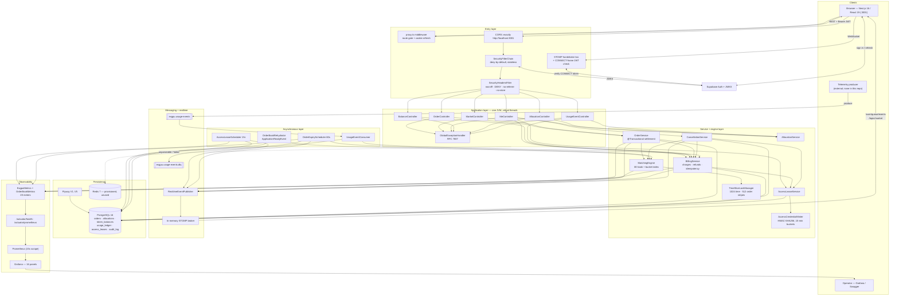

---

## 41. Code map

Jump-off points for the architectural claims in this document.

| Claim | Where to look |
| --- | --- |
| Three-dimensional matching, price-time priority, window intersection | [`engine/MatchingEngine.java`](exgpu/src/main/java/com/exgpu/exgpu/engine/MatchingEngine.java) — `runMatch`, `gatherCandidates` |
| Two-tier locking, bucket derivation, deadlock argument | [`engine/TimeSliceLockManager.java`](exgpu/src/main/java/com/exgpu/exgpu/engine/TimeSliceLockManager.java) |
| Settlement, per-allocation drops, compensating rollback | [`service/OrderService.java`](exgpu/src/main/java/com/exgpu/exgpu/service/OrderService.java) — `matchAndSettle`, `registerCompensatingRollback`, `dropAndCompensate` |
| Booking charges, refunds, idempotency, KillCompute | [`service/BillingService.java`](exgpu/src/main/java/com/exgpu/exgpu/service/BillingService.java) |
| Conditional counterparty write and the expiry sweep | [`repository/OrderRepository.java`](exgpu/src/main/java/com/exgpu/exgpu/repository/OrderRepository.java) — `applyFill`, `expirePastWindows` |
| Idempotent lease transitions | [`repository/AccessLeaseRepository.java`](exgpu/src/main/java/com/exgpu/exgpu/repository/AccessLeaseRepository.java) |
| Credential format, bucket idempotency, constant-time verify | [`service/AccessCredentialMinter.java`](exgpu/src/main/java/com/exgpu/exgpu/service/AccessCredentialMinter.java) |
| Clock-derived access state and balance gating | [`service/AccessLeaseService.java`](exgpu/src/main/java/com/exgpu/exgpu/service/AccessLeaseService.java) — `describeAccess` |
| Refund tiers and capacity release | [`domain/enums/RefundTier.java`](exgpu/src/main/java/com/exgpu/exgpu/domain/enums/RefundTier.java), [`service/CancellationService.java`](exgpu/src/main/java/com/exgpu/exgpu/service/CancellationService.java) |
| DST-correct recurrence expansion | [`engine/RecurrenceExpander.java`](exgpu/src/main/java/com/exgpu/exgpu/engine/RecurrenceExpander.java) |
| Startup rehydration and the single-instance assumption | [`engine/OrderBookRehydrator.java`](exgpu/src/main/java/com/exgpu/exgpu/engine/OrderBookRehydrator.java) |
| Kafka ingestion and DLQ routing | [`kafka/UsageEventConsumer.java`](exgpu/src/main/java/com/exgpu/exgpu/kafka/UsageEventConsumer.java) |
| Security chain, JWKS decoder, CORS | [`config/SecurityConfig.java`](exgpu/src/main/java/com/exgpu/exgpu/config/SecurityConfig.java) |
| Principal resolution from the JWT | [`config/CurrentUser.java`](exgpu/src/main/java/com/exgpu/exgpu/config/CurrentUser.java) |
| STOMP authentication and per-user routing | [`config/WebSocketAuthChannelInterceptor.java`](exgpu/src/main/java/com/exgpu/exgpu/config/WebSocketAuthChannelInterceptor.java), [`config/WebSocketConfig.java`](exgpu/src/main/java/com/exgpu/exgpu/config/WebSocketConfig.java) |
| Post-commit side effects | [`config/AfterCommit.java`](exgpu/src/main/java/com/exgpu/exgpu/config/AfterCommit.java) |
| Metric naming rules and histogram configuration | [`metrics/ExgpuMetrics.java`](exgpu/src/main/java/com/exgpu/exgpu/metrics/ExgpuMetrics.java) |
| Error mapping | [`controller/GlobalExceptionHandler.java`](exgpu/src/main/java/com/exgpu/exgpu/controller/GlobalExceptionHandler.java) |
| Runtime configuration and its rationale | [`src/main/resources/application.properties`](exgpu/src/main/resources/application.properties) |
| Schema and its constraints | [`src/main/resources/db/migrations/`](exgpu/src/main/resources/db/migrations/) |
| Local topology and healthcheck reasoning | [`docker-compose.yml`](exgpu/docker-compose.yml) |
| Scrape config and dashboard | [`prometheus/prometheus.yml`](exgpu/prometheus/prometheus.yml), [`grafana/dashboards/exgpu.json`](exgpu/grafana/dashboards/exgpu.json) |
| Concurrency proofs | [`src/test/java/.../engine/MatchingEngineConcurrencyTest.java`](exgpu/src/test/java/com/exgpu/exgpu/engine/MatchingEngineConcurrencyTest.java), [`TimeSliceLockManagerTest.java`](exgpu/src/test/java/com/exgpu/exgpu/engine/TimeSliceLockManagerTest.java) |
| Frontend API contract and token plumbing | [`frontend/src/lib/api.ts`](frontend/src/lib/api.ts), [`frontend/src/lib/auth-context.tsx`](frontend/src/lib/auth-context.tsx) |
| WebSocket subscription and the market-version pattern | [`frontend/src/lib/events-context.tsx`](frontend/src/lib/events-context.tsx) |
| Route protection and safe redirect handling | [`frontend/src/proxy.ts`](frontend/src/proxy.ts), [`frontend/src/lib/navigation.ts`](frontend/src/lib/navigation.ts) |
| CSP and production config assertions | [`frontend/next.config.mjs`](frontend/next.config.mjs) |
